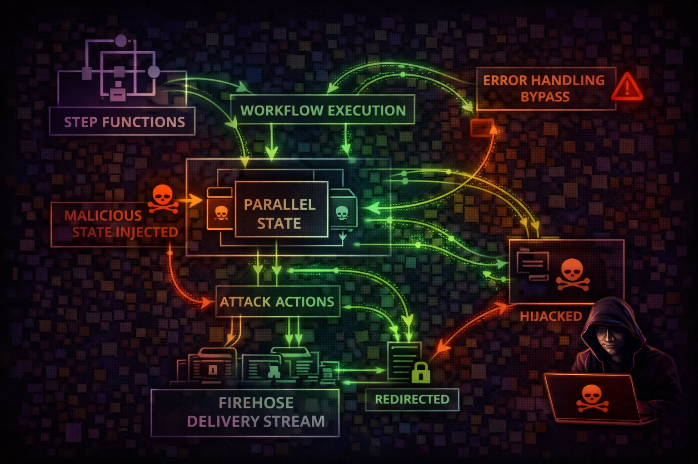

#  AWS Step Functions Security



> **Category**: WORKFLOW ORCHESTRATION

Step Functions is a serverless workflow orchestration service that coordinates multiple AWS services. Attackers exploit workflow definitions to chain service calls, extract data through state machine execution, and leverage powerful IAM roles to access resources across the AWS account.

## Quick Stats

| Privilege Escalation Risk | AWS Service Integrations | Max Execution Time | SDK Integration |
| --- | --- | --- | --- |
| **CRITICAL** | **200+** | **1 Year** | **Direct** |

## Service Overview

### State Machines & SDK Integration

Step Functions uses JSON-based Amazon States Language (ASL) to define workflows. With SDK integration, state machines can directly invoke 200+ AWS SDK actions without custom Lambda code. Task states, Map states, and Parallel states enable complex multi-service orchestration.

> Attack note: A single state machine with an overprivileged role is effectively an attack playbook. It can read DynamoDB, get secrets, invoke Lambda, and write to S3 in one execution.

### Execution History & Activities

Execution history contains all input/output data for every state transition. Activity tasks use worker-based polling. Express workflows handle high-volume events. All execution data is visible to anyone with GetExecutionHistory permission.

> Attack note: Execution history is a goldmine - it contains every API response, secret value, and data payload that flowed through previous workflow runs.

## Security Risk Assessment

`█████████░` **8.5/10** (CRITICAL)

Step Functions can directly invoke 200+ AWS SDK actions with powerful IAM roles. Attackers can create workflows to chain service calls, access data, and execute code - essentially building attack playbooks as state machines.

## ⚔️ Attack Vectors

### Workflow Exploitation

- Malicious state machine creation with overprivileged role
- SDK integration abuse (direct AWS API calls)
- Execution history mining for secrets
- Input/output data interception

### Worker & Activity Attacks

- Activity worker hijacking via GetActivityTask
- Task token theft from execution history
- Express workflow high-volume abuse
- Workflow role assumption for lateral movement

## ⚠️ Misconfigurations

### Role & Permission Issues

- Overly permissive execution role (Action: *)
- Broad CreateStateMachine access
- PassRole without resource restriction
- No execution logging enabled

### Data Protection Gaps

- Sensitive data in state input/output
- Unencrypted execution data
- Missing activity task authentication
- Execution history retention too long

## 🔍 Enumeration

**List State Machines**
```bash
aws stepfunctions list-state-machines
```

**Get Definition**
```bash
aws stepfunctions describe-state-machine --state-machine-arn <arn> --query 'definition' --output text
```

**List Executions**
```bash
aws stepfunctions list-executions --state-machine-arn <arn>
```

**Get Execution History**
```bash
aws stepfunctions get-execution-history --execution-arn <execution-arn>
```

## 📈 Privilege Escalation

### Role-Based Escalation

- Create state machine with admin execution role
- Workflow calling STS:AssumeRole for cross-account
- SDK integration to create IAM access keys
- Lambda invoke with elevated function role

### Data-Based Escalation

- Workflow reading secrets from Secrets Manager
- DynamoDB scan for credentials in tables
- S3 GetObject for configuration files
- Execution history containing prior secrets

> **Key insight:** If you have states:CreateStateMachine + iam:PassRole, you can create a workflow that calls ANY AWS API the execution role allows. This is privilege escalation via workflow creation.

## 🔗 Persistence

### Workflow-Based Persistence

- Scheduled workflow via EventBridge for periodic access
- Long-running standard workflow (up to 1 year)
- Self-restarting workflow via callback pattern
- Wait state with future timestamp for delayed action

### Infrastructure Persistence

- Hidden state machine among many legitimate ones
- Activity worker polling from external infrastructure
- Workflow creating new IAM keys on schedule
- State machine updating its own definition

## 🛡️ Detection

### CloudTrail Events

- CreateStateMachine (new workflow)
- UpdateStateMachine (definition change)
- StartExecution (workflow trigger)
- GetExecutionHistory (data mining)

### Behavioral Indicators

- New state machines with broad SDK actions
- Executions by unknown principals
- State machines calling STS/IAM/SecretsManager
- Activity task polling from external IPs

> **Tool reference:** Pacu module stepfunctions__enum discovers state machines and their execution roles. Use --include-execution-data to mine history.

## Exploitation Commands

**Create Malicious State Machine**
```bash
aws stepfunctions create-state-machine --name exfil-workflow --definition '{"StartAt":"Scan","States":{"Scan":{"Type":"Task","Resource":"arn:aws:states:::dynamodb:scan","Parameters":{"TableName":"users"},"End":true}}}' --role-arn arn:aws:iam::123:role/StepFunctionRole
```

**Start Execution**
```bash
aws stepfunctions start-execution --state-machine-arn <arn> --input '{"target":"sensitive-data"}'
```

**Mine Execution History**
```bash
aws stepfunctions get-execution-history --execution-arn <execution-arn> --query 'events[?type==`TaskSucceeded`].taskSucceededEventDetails.output'
```

**List All State Machines**
```bash
aws stepfunctions list-state-machines --query 'stateMachines[*].{Name:name,ARN:stateMachineArn,Role:roleArn}'
```

**Steal Activity Tasks**
```bash
aws stepfunctions get-activity-task --activity-arn arn:aws:states:us-east-1:123:activity:process-orders
```

**Describe Execution (Get I/O)**
```bash
aws stepfunctions describe-execution --execution-arn <arn> --query '{Input:input,Output:output}'
```

## Policy Examples

### ❌ Dangerous - Permissive Execution Role

```json
{
  "Effect": "Allow",
  "Action": "*",
  "Resource": "*"
}

// This role can do ANYTHING via the workflow:
// - Read all S3/DynamoDB
// - Get all secrets
// - Assume any role
// - Create IAM users
```

*State machine role with broad access enables any attack via workflow*

### ❌ Dangerous - CreateStateMachine + PassRole

```json
{
  "Effect": "Allow",
  "Action": [
    "states:CreateStateMachine",
    "states:StartExecution",
    "iam:PassRole"
  ],
  "Resource": "*"
}
// Can create workflow with ANY role
// then execute it = privilege escalation
```

*CreateStateMachine + PassRole on * = create workflow with admin role = admin access*

### ✅ Secure - Scoped Execution Role

```json
{
  "Effect": "Allow",
  "Action": [
    "lambda:InvokeFunction"
  ],
  "Resource": [
    "arn:aws:lambda:*:*:function:process-order",
    "arn:aws:lambda:*:*:function:send-notification"
  ]
},
{
  "Effect": "Allow",
  "Action": "dynamodb:PutItem",
  "Resource": "arn:aws:dynamodb:*:*:table/orders"
}
```

*Limited to specific Lambda functions and DynamoDB table needed by workflow*

### ✅ Secure - Restricted PassRole

```json
{
  "Effect": "Allow",
  "Action": "states:CreateStateMachine",
  "Resource": "*"
},
{
  "Effect": "Allow",
  "Action": "iam:PassRole",
  "Resource": "arn:aws:iam::123:role/OrderWorkflowRole",
  "Condition": {
    "StringEquals": {
      "iam:PassedToService": "states.amazonaws.com"
    }
  }
}
```

*PassRole restricted to specific role and service - prevents escalation via arbitrary roles*

## Defense Recommendations

### 🔒 Least Privilege Execution Roles

Scope state machine roles to only required actions and resources. Never use Action: *.

```bash
Grant only specific actions:\n  lambda:InvokeFunction on specific ARNs\n  dynamodb:PutItem on specific tables
```

### 📊 Enable Execution Logging

Log all execution data to CloudWatch for audit trail and forensic analysis.

```bash
LoggingConfiguration: {\n  "level": "ALL",\n  "includeExecutionData": true,\n  "destinations": [{"cloudWatchLogsLogGroup": {...}}]\n}
```

### 🛡️ Restrict CreateStateMachine

Limit who can create new state machines via IAM policies and SCPs.

```bash
SCP: Deny states:CreateStateMachine\n  except from approved admin roles
```

### 🔐 Encrypt Execution Data

Use KMS encryption for execution history and CloudWatch logs.

```bash
aws stepfunctions create-state-machine \\\n  --encryption-configuration \\\n  kmsKeyId=arn:aws:kms:...:key/xxx
```

### 👁️ Monitor Execution History Access

Alert on GetExecutionHistory calls that may expose sensitive data from prior runs.

```bash
CloudWatch Alarm:\n  GetExecutionHistory from unknown principals\n  or outside business hours
```

### ⚙️ Validate Activity Workers

Implement authentication for activity task workers and monitor for rogue pollers.

```bash
Monitor GetActivityTask calls\nAlert on polling from unexpected IPs\nUse VPC endpoints for workers
```

---

*AWS Step Functions Security Card*

*Always obtain proper authorization before testing*
