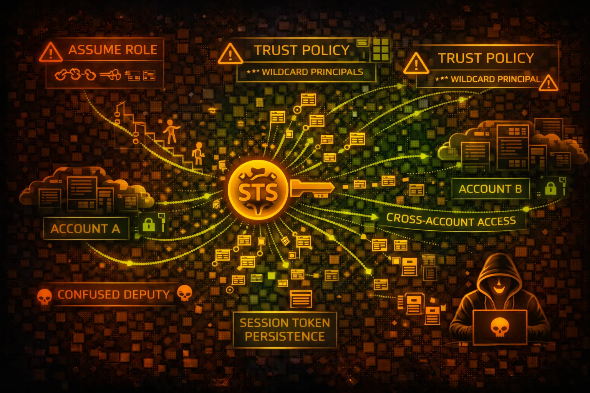

#  AWS STS Security



> **Category**: IDENTITY

Security Token Service (STS) provides temporary credentials for assuming IAM roles. The core of AWS identity - overly permissive trust policies enable cross-account attacks and privilege escalation.

## Quick Stats

| Risk Level | Scope | Credentials | Duration |
| --- | --- | --- | --- |
| **CRITICAL** | **Global** | **Temp** | **15m-12h** |

## Service Overview

### AssumeRole

Exchange long-term credentials for temporary session credentials. Trust policies control who can assume the role. Used for cross-account access and privilege delegation.

> Attack note: Overly permissive trust policies (Principal: *) allow any AWS account to assume the role

### Federation

AssumeRoleWithSAML and AssumeRoleWithWebIdentity enable external identity providers (Okta, OIDC) to exchange tokens for AWS credentials.

> Attack note: SAML assertion manipulation and OIDC token theft enable privilege escalation

## Security Risk Assessment

`██████████` **9.5/10** (CRITICAL)

STS is the core of AWS identity and the primary mechanism for lateral movement. Misconfigured trust policies enable cross-account attacks. Role chaining amplifies impact.

## ⚔️ Attack Vectors

### Trust Policy Attacks

- Overly permissive trust policies
- Missing ExternalId condition
- Cross-account role chaining
- Confused deputy attacks
- Principal: * allowing any account

### Credential Theft

- Session token theft from IMDS
- IRSA token extraction from pods
- SAML assertion replay/manipulation
- Web identity token theft
- Environment variable extraction

## ⚠️ Misconfigurations

### Trust Policy Issues

- Principal: * in trust policy
- No MFA requirement for assume
- Long session duration (12h)
- Missing source identity conditions
- No IP restriction in trust

### Role Issues

- Overly permissive IAM policies
- Service-linked roles accessible
- Missing permission boundaries
- No session policy restrictions
- Allows cross-account without ExternalId

## 🔍 Enumeration

**Get Caller Identity**
```bash
aws sts get-caller-identity
```

**List Assumable Roles**
```bash
aws iam list-roles \\
  --query 'Roles[?AssumeRolePolicyDocument]'
```

**Get Trust Policy**
```bash
aws iam get-role --role-name <role> \\
  --query 'Role.AssumeRolePolicyDocument'
```

**Get Session Token**
```bash
aws sts get-session-token \\
  --duration-seconds 3600
```

## 📈 Privilege Escalation

### Role Assumption

- AssumeRole to higher privilege
- Role chaining across accounts
- Assume service-linked roles
- Web identity federation abuse
- SAML assertion manipulation

### Attack Paths

- Dev account -> Prod via trust
- External account -> Internal role
- Lambda execution role pivot
- EC2 instance role escalation
- Cross-account admin access

> **Key Target:** Roles with Principal: * or missing ExternalId can be assumed from any AWS account.

## 🔗 Persistence

### Trust Policy Backdoors

- Modify trust policy for backdoor
- Add external account to trust
- Create assumable role
- Federation provider backdoor
- OIDC identity provider injection

### Session Persistence

- Session token refresh loop
- Long duration sessions (12h)
- Automated re-assumption
- Multiple role chains active
- Cached credentials abuse

## 🛡️ Detection

### CloudTrail Events

- AssumeRole - role assumed
- AssumeRoleWithSAML - SAML federation
- AssumeRoleWithWebIdentity - OIDC
- GetSessionToken - temp creds
- GetCallerIdentity - identity check

### Indicators of Compromise

- Cross-account role assumption
- Unusual session durations
- Failed AssumeRole attempts
- Trust policy modifications
- New OIDC/SAML providers

## Exploitation Commands

**Assume Role**
```bash
aws sts assume-role \\
  --role-arn arn:aws:iam::<target>:role/<role> \\
  --role-session-name pwned
```

**Assume with ExternalId**
```bash
aws sts assume-role \\
  --role-arn <arn> \\
  --external-id <id> \\
  --role-session-name pwned
```

**Web Identity Assume**
```bash
aws sts assume-role-with-web-identity \\
  --role-arn <arn> \\
  --web-identity-token <token> \\
  --role-session-name pwned
```

**Get Federation Token**
```bash
aws sts get-federation-token \\
  --name attacker \\
  --policy '{"Version":"2012-10-17",...}'
```

**Decode Authorization Message**
```bash
aws sts decode-authorization-message \\
  --encoded-message <message>
```

**Test Role Assumption**
```bash
for role in $(aws iam list-roles --query 'Roles[].Arn' --output text); do
  aws sts assume-role --role-arn $role --role-session-name test 2>/dev/null && echo "SUCCESS: $role"
done
```

## Policy Examples

### ❌ Dangerous - Any Account Can Assume

```json
{
  "Version": "2012-10-17",
  "Statement": [{
    "Effect": "Allow",
    "Principal": {"AWS": "*"},
    "Action": "sts:AssumeRole"
  }]
}
// ANY AWS account can assume this role!
```

*Anyone with an AWS account can assume this role - complete compromise*

### ✅ Secure - Restricted with ExternalId and MFA

```json
{
  "Version": "2012-10-17",
  "Statement": [{
    "Effect": "Allow",
    "Principal": {
      "AWS": "arn:aws:iam::123456789012:root"
    },
    "Action": "sts:AssumeRole",
    "Condition": {
      "StringEquals": {
        "sts:ExternalId": "unique-secret-id"
      },
      "Bool": {"aws:MultiFactorAuthPresent": "true"}
    }
  }]
}
```

*Specific account only, requires ExternalId and MFA*

## Defense Recommendations

### 🔐 Always Use ExternalId

Prevent confused deputy attacks with unique external IDs.

```bash
"Condition": {"StringEquals": {
  "sts:ExternalId": "unique-secret-12345"
}}
```

### 📱 Require MFA for AssumeRole

Add MFA condition to sensitive roles for additional verification.

```bash
"Condition": {"Bool": {
  "aws:MultiFactorAuthPresent": "true"
}}
```

### ⏱️ Limit Session Duration

Reduce exposure window by limiting maximum session duration.

```bash
aws iam update-role --role-name <role> \\
  --max-session-duration 3600
```

### 🏷️ Source Identity Tracking

Track original identity through role chains for auditing.

```bash
"Condition": {"StringLike": {
  "sts:SourceIdentity": "admin-*"
}}
```

### 🌐 Restrict by Source IP

Limit where role can be assumed from using IP conditions.

```bash
"Condition": {"IpAddress": {
  "aws:SourceIp": "203.0.113.0/24"
}}
```

### 📊 Monitor AssumeRole Events

Alert on cross-account assumptions and unusual patterns.

```bash
CloudWatch Alarm: sts:AssumeRole where sourceAccount != targetAccount
```

---

*AWS STS Security Card*

*Always obtain proper authorization before testing*
