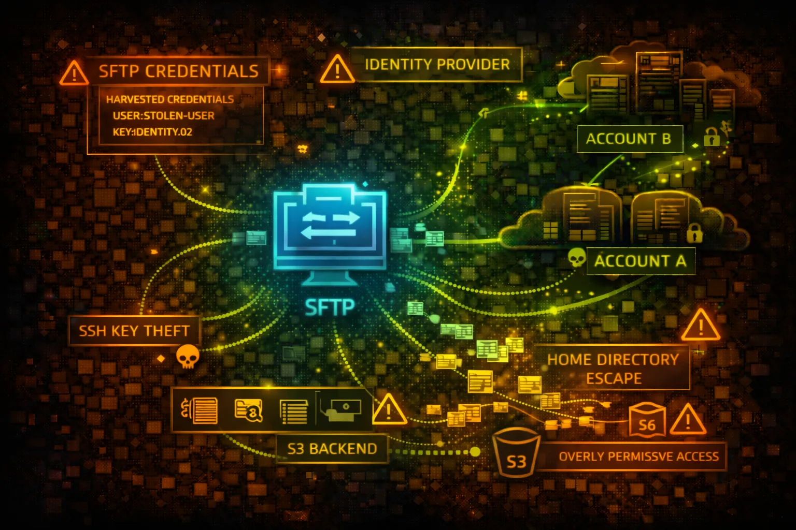

#  AWS Transfer Family Security



> **Category**: MANAGED FILE TRANSFER

AWS Transfer Family provides managed SFTP, FTPS, FTP, and AS2 servers for file transfers to and from S3 or EFS. User credentials map to IAM roles for S3 access. Attackers target weak authentication, credential theft, and the underlying storage.

## Quick Stats

| Risk Level | SFTP/FTPS/FTP/AS2 | Backend Storage | User Access |
| --- | --- | --- | --- |
| **HIGH** | **4 Protocols** | **S3/EFS** | **IAM Roles** |

## Service Overview

### Protocol Support

Transfer Family supports SFTP (SSH File Transfer Protocol), FTPS (FTP over TLS), FTP (unencrypted), and AS2 (B2B messaging). Each server can be configured with public or VPC endpoints for access control.

> Attack note: FTP transmits credentials in cleartext - network sniffing or protocol downgrade attacks are viable

### User Authentication

Users authenticate via SSH keys, passwords, or custom identity providers (Lambda/API Gateway). Each user maps to an IAM role that controls S3/EFS access. Home directories scope user access to specific paths.

> Attack note: Overly permissive IAM roles or weak home directory scoping allows access beyond intended paths

## Security Risk Assessment

`████████░░` **7.5/10** (HIGH)

Transfer Family exposes file transfer protocols to external users and partners. Compromised credentials provide direct access to S3 buckets or EFS file systems. The IAM role assumed by users can enable privilege escalation if misconfigured.

## ⚔️ Attack Vectors

### Credential Attacks

- Brute force SSH/SFTP passwords
- Steal SSH private keys from compromised systems
- Credential stuffing against user accounts
- Exploit weak custom identity provider
- Intercept FTP credentials on network

### Protocol & Access Exploitation

- Protocol downgrade from SFTP to FTP
- Path traversal beyond home directory
- Assume overprivileged IAM role via user
- Access sensitive files in S3/EFS backend
- Exfiltrate data through file transfers

## ⚠️ Misconfigurations

### Authentication Weaknesses

- FTP protocol enabled (unencrypted)
- Weak passwords allowed
- SSH keys without passphrase
- Custom identity provider returns overprivileged role
- Missing multi-factor authentication

### Access Control Issues

- User IAM role with s3:* permissions
- Missing home directory restrictions
- S3 bucket allows ListBucket without prefix
- EFS not encrypted at rest
- Public endpoint without IP allowlisting

## 🔍 Enumeration

**List Transfer Servers**
```bash
aws transfer list-servers
```

**Describe Server Configuration**
```bash
aws transfer describe-server \\
  --server-id s-1234567890abcdef0
```

**List Users on Server**
```bash
aws transfer list-users \\
  --server-id s-1234567890abcdef0
```

**Describe User (Get IAM Role)**
```bash
aws transfer describe-user \\
  --server-id s-1234567890abcdef0 \\
  --user-name ftpuser
```

**List Server SSH Host Keys**
```bash
aws transfer describe-server \\
  --server-id s-1234567890abcdef0 \\
  --query 'Server.HostKeyFingerprint'
```

## 🔑 Credential Theft & Abuse

### Credential Sources

- SSH private keys in ~/.ssh directories
- FileZilla/WinSCP saved credentials
- Environment variables with passwords
- CI/CD pipeline SFTP configurations
- Partner portal password storage

### Post-Compromise Actions

- Connect via SFTP with stolen credentials
- Access mapped S3 bucket contents
- Upload malicious files (ransomware/backdoors)
- Download sensitive data files
- Pivot to other resources via IAM role

> **Quick Win:** Check ~/.ssh/config and FileZilla sitemanager.xml for saved Transfer Family credentials.

## 👤 IAM Role Exploitation

### Overprivileged Roles

- User role with full S3 access (s3:*)
- Role can access buckets beyond home directory
- Cross-account S3 access enabled
- Role has iam:PassRole for escalation
- Attached policies allow other services

### Role Abuse Techniques

- List all accessible S3 buckets via SFTP
- Download files from unintended paths
- Upload to shared/public S3 paths
- Access other AWS services if role permits
- Enumerate role permissions through API

## 🛡️ Detection

### CloudTrail Events

- DescribeServer - server enumeration
- ListUsers - user enumeration
- CreateUser - new user creation
- UpdateUser - user modification
- DeleteUser - user deletion

### Indicators of Compromise

- Failed authentication attempts spike
- Logins from unusual IP addresses
- Large file transfers at odd hours
- Access to files outside home directory
- New users created without change ticket

## Exploitation Commands

**Connect via SFTP**
```bash
sftp -i ~/.ssh/stolen_key \\
  ftpuser@s-1234567890abcdef0.server.transfer.us-east-1.amazonaws.com
```

**Test Credentials with sshpass**
```bash
sshpass -p 'password123' sftp \\
  ftpuser@s-xxx.server.transfer.us-east-1.amazonaws.com
```

**List Server Details (Recon)**
```bash
aws transfer describe-server \\
  --server-id s-1234567890abcdef0 \\
  --query 'Server.{Protocols:Protocols,Endpoint:EndpointType,Identity:IdentityProviderType}'
```

**Get User IAM Role ARN**
```bash
aws transfer describe-user \\
  --server-id s-xxx \\
  --user-name ftpuser \\
  --query 'User.Role'
```

**Brute Force with Hydra**
```bash
hydra -L users.txt -P passwords.txt \\
  sftp://s-xxx.server.transfer.us-east-1.amazonaws.com
```

**Create Backdoor User**
```bash
aws transfer create-user \\
  --server-id s-xxx \\
  --user-name backdoor \\
  --role arn:aws:iam::ACCOUNT:role/TransferRole \\
  --ssh-public-key-body "ssh-rsa AAAA..."
```

**Download All Files Recursively**
```bash
# After SFTP connection
sftp> get -r /
```

**Upload Malicious File**
```bash
# After SFTP connection
sftp> put backdoor.php /var/www/html/
```

**List All Accessible Directories**
```bash
# After SFTP connection
sftp> ls -la /
sftp> ls -la ..
```

**Check for Path Traversal**
```bash
# After SFTP connection
sftp> cd ../../../
sftp> ls -la
```

## Policy Examples

### ❌ Dangerous - Full S3 Access

```json
{
  "Version": "2012-10-17",
  "Statement": [{
    "Effect": "Allow",
    "Action": "s3:*",
    "Resource": "*"
  }]
}
```

*User can access any S3 bucket, not just their intended home directory*

### ✅ Secure - Scoped S3 Access

```json
{
  "Version": "2012-10-17",
  "Statement": [{
    "Effect": "Allow",
    "Action": ["s3:GetObject", "s3:PutObject"],
    "Resource": "arn:aws:s3:::bucket/home/\${transfer:UserName}/*"
  }]
}
```

*User can only access their specific home directory using session variable*

### ❌ Dangerous - ListBucket Without Prefix

```json
{
  "Version": "2012-10-17",
  "Statement": [{
    "Effect": "Allow",
    "Action": "s3:ListBucket",
    "Resource": "arn:aws:s3:::company-data"
  }]
}
```

*User can list entire bucket contents, discovering all files*

### ✅ Secure - Scoped ListBucket

```json
{
  "Version": "2012-10-17",
  "Statement": [{
    "Effect": "Allow",
    "Action": "s3:ListBucket",
    "Resource": "arn:aws:s3:::company-data",
    "Condition": {
      "StringLike": {
        "s3:prefix": "home/\${transfer:UserName}/*"
      }
    }
  }]
}
```

*User can only list their home directory, not other paths*

## Defense Recommendations

### 🔐 Disable FTP Protocol

Only enable SFTP or FTPS to ensure encrypted credential transmission.

```bash
aws transfer update-server \\
  --server-id s-xxx \\
  --protocols SFTP
```

### 📁 Enforce Home Directory Scoping

Use logical directory mappings to restrict user access to specific paths.

```bash
"HomeDirectoryMappings": [{
  "Entry": "/",
  "Target": "/bucket/home/\${transfer:UserName}"
}]
```

### 🔒 Use SSH Key Authentication Only

Disable password authentication and require SSH key pairs.

### 🌐 Deploy VPC Endpoint

Use VPC endpoint instead of public endpoint to limit network exposure.

```bash
--endpoint-type VPC \\
--vpc-id vpc-xxx \\
--subnet-ids subnet-xxx
```

### 📊 Enable Structured Logging

Enable CloudWatch logging for all file operations and authentication events.

```bash
--structured-log-destinations \\
  arn:aws:logs:us-east-1:ACCOUNT:log-group:/aws/transfer/s-xxx
```

### 🚫 Implement IP Allowlisting

Use security groups or Network ACLs to restrict source IP addresses.

---

*AWS Transfer Family Security Card*

*Always obtain proper authorization before testing*
