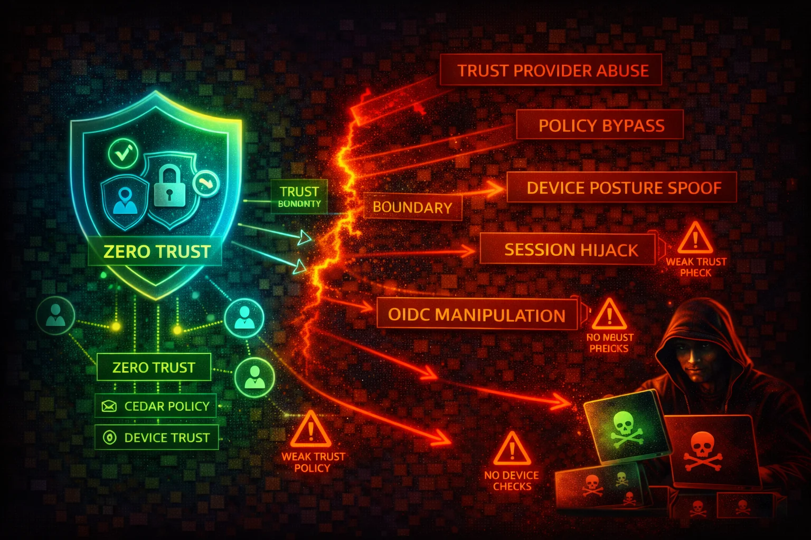

#  AWS Verified Access Security



> **Category**: NETWORKING

## Quick Stats

| Attribute        | Value                                      |
|------------------|--------------------------------------------|
| Risk Level       | MEDIUM                                     |
| Scope            | Regional                                   |
| Key Components   | Instances, Groups, Endpoints, Trust Providers |
| Policy Language  | Cedar                                      |

---

## 📋 Service Overview

AWS Verified Access provides secure access to corporate applications without requiring a VPN. It evaluates each access request in real time against access policies you define, using identity and device posture data from configured trust providers. Access is granted per-application only when security requirements (user identity, group membership, device compliance) are met.

**Core components:**

- **Verified Access Instance** — The top-level resource that ties together trust providers and groups. You attach at least one trust provider to each instance.
- **Trust Provider** — Supplies identity or device posture data. One identity trust provider (IAM Identity Center or OIDC-compatible IdP) and multiple device trust providers (CrowdStrike, Jamf, JumpCloud) can be attached per instance.
- **Verified Access Group** — A collection of endpoints that share an access policy. Group-level Cedar policies are inherited by all endpoints in the group.
- **Verified Access Endpoint** — Represents a single application. Endpoint types include `load-balancer`, `network-interface`, `rds`, and `cidr`. Each endpoint belongs to one group and can optionally have its own endpoint-level Cedar policy that is evaluated in addition to the group policy.

**Attack note:** Verified Access is a security control, so compromising it means bypassing zero-trust enforcement entirely. An attacker who can modify group or endpoint policies, or attach a trust provider they control, can grant themselves access to every protected application.

**Attack note:** Cedar policies default to implicit deny — but an overly broad `permit` statement at the group level with no endpoint-level restrictions grants access to all endpoints in that group.

---

## Security Risk Assessment

| Score | Level  |
|-------|--------|
| 6.5   | MEDIUM |

Verified Access is a protective control, not a data store. The primary risk is misconfiguration that weakens or bypasses access enforcement. Compromise of the trust provider or overly permissive Cedar policies can expose all protected applications.

---

## ⚔️ Attack Vectors

### Trust Provider Abuse

- Compromise the OIDC identity provider to issue tokens that satisfy Cedar policy conditions
- Register a rogue device trust provider to supply fabricated device posture data
- Exploit misconfigured OIDC scopes or claims to elevate group membership
- Steal or replay user session tokens to bypass identity verification
- Target the IdP admin console to add attacker-controlled users to authorized groups

### Policy and Configuration Manipulation

- Modify group policy to a blanket `permit` statement, granting access to all endpoints in the group
- Disable the policy on an endpoint (`--no-policy-enabled`) to remove enforcement
- Create a new endpoint in a permissive group pointing to a sensitive internal application
- Attach an attacker-controlled trust provider to the Verified Access instance
- Delete the Verified Access endpoint for an application, forcing fallback to less secure access paths

---

## ⚠️ Misconfigurations

### Policy Weaknesses

- Group policy uses `permit(principal, action, resource);` with no conditions — allows all authenticated users
- Endpoint policy not enabled (`PolicyEnabled: false`), relying solely on group policy
- Cedar policy checks identity claims but ignores device posture, allowing access from unmanaged devices
- Policy references a trust provider context key that does not exist, causing silent evaluation failures
- No endpoint-level policy refinement — all applications in a group share identical access requirements

### Operational Gaps

- Access logging not enabled on the Verified Access instance — no audit trail of access decisions
- Trust provider not validated — OIDC issuer URL points to a misconfigured or deprecated IdP
- No device trust provider attached — access decisions are based solely on identity with no device compliance check
- Verified Access instance has no tags or naming convention, making it difficult to audit
- Endpoints configured with `network-interface` type exposed to broader network segments than intended

---

## 🔍 Enumeration

### List Verified Access Instances

```bash
aws ec2 describe-verified-access-instances
```

Source: [AWS CLI Reference — describe-verified-access-instances](https://docs.aws.amazon.com/cli/latest/reference/ec2/describe-verified-access-instances.html)

### List Trust Providers

```bash
aws ec2 describe-verified-access-trust-providers
```

Source: [AWS CLI Reference — describe-verified-access-trust-providers](https://docs.aws.amazon.com/cli/latest/reference/ec2/describe-verified-access-trust-providers.html)

### List Verified Access Groups

```bash
aws ec2 describe-verified-access-groups
```

Source: [AWS CLI Reference — describe-verified-access-groups](https://docs.aws.amazon.com/cli/latest/reference/ec2/describe-verified-access-groups.html)

### List Verified Access Endpoints

```bash
aws ec2 describe-verified-access-endpoints
```

Source: [AWS CLI Reference — describe-verified-access-endpoints](https://docs.aws.amazon.com/cli/latest/reference/ec2/describe-verified-access-endpoints.html)

### Get Group Policy (Cedar)

```bash
aws ec2 get-verified-access-group-policy \
  --verified-access-group-id vagr-0dbe967baf14b7235
```

Source: [AWS CLI Reference — get-verified-access-group-policy](https://docs.aws.amazon.com/cli/latest/reference/ec2/get-verified-access-group-policy.html)

### Get Endpoint Policy (Cedar)

```bash
aws ec2 get-verified-access-endpoint-policy \
  --verified-access-endpoint-id vae-066fac616d4d546f2
```

Source: [AWS CLI Reference — get-verified-access-endpoint-policy](https://docs.aws.amazon.com/cli/latest/reference/ec2/get-verified-access-endpoint-policy.html)

### Check Logging Configuration

```bash
aws ec2 describe-verified-access-instance-logging-configurations \
  --verified-access-instance-ids vai-0ce000c0b7643abea
```

Source: [AWS CLI Reference — describe-verified-access-instance-logging-configurations](https://docs.aws.amazon.com/cli/latest/reference/ec2/describe-verified-access-instance-logging-configurations.html)

---

## 📈 Privilege Escalation

Verified Access itself is not a path to IAM privilege escalation in the traditional sense. However, an attacker with `ec2:ModifyVerifiedAccessGroupPolicy` or `ec2:ModifyVerifiedAccessEndpointPolicy` permissions can weaken or remove access controls on protected applications, effectively granting themselves (or any user) access to internal resources.

**Key escalation actions:**

- `ec2:ModifyVerifiedAccessGroupPolicy` — Replace the Cedar policy on a group with a blanket permit, granting access to all endpoints in that group
- `ec2:ModifyVerifiedAccessEndpointPolicy` — Disable or weaken the policy on a specific endpoint
- `ec2:CreateVerifiedAccessEndpoint` — Add a new endpoint pointing to a sensitive internal resource under a permissive group
- `ec2:AttachVerifiedAccessTrustProvider` — Attach an attacker-controlled trust provider to supply fabricated identity or device data
- `ec2:CreateVerifiedAccessTrustProvider` — Register a new trust provider pointing to an attacker-controlled OIDC issuer
- `ec2:ModifyVerifiedAccessInstance` — Modify the instance description or CIDR endpoint custom subdomain (limited direct impact, but could obscure audit trail by changing descriptions)

---

## 📜 Policy Examples

### Bad: Blanket Permit with No Conditions

```json
{
  "Version": "2012-10-17",
  "Statement": [
    {
      "Effect": "Allow",
      "Action": [
        "ec2:ModifyVerifiedAccessGroupPolicy",
        "ec2:ModifyVerifiedAccessEndpointPolicy",
        "ec2:CreateVerifiedAccessTrustProvider",
        "ec2:AttachVerifiedAccessTrustProvider"
      ],
      "Resource": "*"
    }
  ]
}
```

**Why it is dangerous:** Grants unrestricted ability to rewrite Cedar policies and attach arbitrary trust providers, allowing an attacker to bypass all Verified Access controls.

### Good: Scoped Read-Only for Auditors

```json
{
  "Version": "2012-10-17",
  "Statement": [
    {
      "Effect": "Allow",
      "Action": [
        "ec2:DescribeVerifiedAccessInstances",
        "ec2:DescribeVerifiedAccessGroups",
        "ec2:DescribeVerifiedAccessEndpoints",
        "ec2:DescribeVerifiedAccessTrustProviders",
        "ec2:GetVerifiedAccessGroupPolicy",
        "ec2:GetVerifiedAccessEndpointPolicy",
        "ec2:DescribeVerifiedAccessInstanceLoggingConfigurations"
      ],
      "Resource": "*"
    }
  ]
}
```

**Why it is safe:** Permits enumeration and policy review without the ability to modify any access control configuration.

### Bad: Cedar Group Policy — No Conditions

```
permit(principal, action, resource);
```

**Why it is dangerous:** Allows any authenticated user from any trust provider to access all endpoints in the group, regardless of group membership, device posture, or any other attribute.

### Good: Cedar Group Policy — Identity and Device Posture

```
permit(principal, action, resource)
when {
  context.idc.groups has "c242c5b0-6081-1845-6fa8-6e0d9513c107" &&
  context.jamf.risk == "LOW"
};
```

**Why it is safe:** Requires the user to be in a specific IAM Identity Center group (referenced by UUID) AND have a Jamf-assessed low-risk device before access is granted. Note: context keys use the trust provider's configured policy reference name (e.g., `context.idc` for IAM Identity Center, `context.jamf` for Jamf, `context.crwd` for CrowdStrike).

---

## 🛡️ Defense Recommendations

### 1. Enable Access Logging on Every Instance

Send Verified Access access logs to CloudWatch Logs, S3, or Kinesis Data Firehose for audit and incident response.

```bash
aws ec2 modify-verified-access-instance-logging-configuration \
  --verified-access-instance-id vai-0ce000c0b7643abea \
  --access-logs S3={Enabled=true,BucketName=my-va-logs-bucket,Prefix=verified-access/}
```

Source: [AWS CLI Reference — modify-verified-access-instance-logging-configuration](https://docs.aws.amazon.com/cli/latest/reference/ec2/modify-verified-access-instance-logging-configuration.html)

### 2. Attach Both Identity and Device Trust Providers

Never rely on identity alone. Attach at least one device trust provider (CrowdStrike, Jamf, or JumpCloud) to enforce device posture checks.

Source: [Device-based trust providers for Verified Access](https://docs.aws.amazon.com/verified-access/latest/ug/device-trust.html)

### 3. Write Restrictive Cedar Policies at Both Group and Endpoint Levels

Use group-level policies for broad requirements (e.g., identity group membership) and endpoint-level policies for application-specific conditions (e.g., MFA, device compliance score).

Source: [Verified Access policies](https://docs.aws.amazon.com/verified-access/latest/ug/auth-policies.html)

### 4. Restrict IAM Permissions for Verified Access Modification

Limit `ec2:ModifyVerifiedAccess*`, `ec2:CreateVerifiedAccess*`, and `ec2:AttachVerifiedAccessTrustProvider` actions to a small set of administrators. Use IAM condition keys and SCPs to prevent unauthorized changes.

Source: [Identity and access management for Verified Access](https://docs.aws.amazon.com/verified-access/latest/ug/security-iam.html)

### 5. Monitor CloudTrail for Policy Changes

Set up CloudWatch Alarms on CloudTrail events for the following API actions:

- `ModifyVerifiedAccessGroupPolicy`
- `ModifyVerifiedAccessEndpointPolicy`
- `CreateVerifiedAccessTrustProvider`
- `AttachVerifiedAccessTrustProvider`
- `DeleteVerifiedAccessEndpoint`

### 6. Validate Trust Provider Configuration Regularly

Audit that the OIDC issuer URL, client ID, and scopes on identity trust providers are correct and point to your organization's IdP. Verify that device trust provider integrations are active and reporting current posture data.

Source: [Trust providers for Verified Access](https://docs.aws.amazon.com/verified-access/latest/ug/trust-providers.html)

---

## References

| Source | URL |
|--------|-----|
| What is AWS Verified Access? | https://docs.aws.amazon.com/verified-access/latest/ug/what-is-verified-access.html |
| How Verified Access works | https://docs.aws.amazon.com/verified-access/latest/ug/how-it-works.html |
| Verified Access policies (Cedar) | https://docs.aws.amazon.com/verified-access/latest/ug/auth-policies.html |
| Trust providers for Verified Access | https://docs.aws.amazon.com/verified-access/latest/ug/trust-providers.html |
| Device-based trust providers | https://docs.aws.amazon.com/verified-access/latest/ug/device-trust.html |
| IAM for Verified Access | https://docs.aws.amazon.com/verified-access/latest/ug/security-iam.html |
| Verified Access access logs | https://docs.aws.amazon.com/verified-access/latest/ug/access-logs-enable.html |
| Walk through Verified Access policies (AWS Security Blog) | https://aws.amazon.com/blogs/security/a-walk-through-aws-verified-access-policies/ |
| Integrating device trust providers (AWS Blog) | https://aws.amazon.com/blogs/networking-and-content-delivery/integrating-aws-verified-access-with-device-trust-providers/ |
| CLI: describe-verified-access-instances | https://docs.aws.amazon.com/cli/latest/reference/ec2/describe-verified-access-instances.html |
| CLI: describe-verified-access-trust-providers | https://docs.aws.amazon.com/cli/latest/reference/ec2/describe-verified-access-trust-providers.html |
| CLI: describe-verified-access-groups | https://docs.aws.amazon.com/cli/latest/reference/ec2/describe-verified-access-groups.html |
| CLI: describe-verified-access-endpoints | https://docs.aws.amazon.com/cli/latest/reference/ec2/describe-verified-access-endpoints.html |
| CLI: get-verified-access-group-policy | https://docs.aws.amazon.com/cli/latest/reference/ec2/get-verified-access-group-policy.html |
| CLI: get-verified-access-endpoint-policy | https://docs.aws.amazon.com/cli/latest/reference/ec2/get-verified-access-endpoint-policy.html |
| CLI: describe-verified-access-instance-logging-configurations | https://docs.aws.amazon.com/cli/latest/reference/ec2/describe-verified-access-instance-logging-configurations.html |
| CLI: modify-verified-access-instance-logging-configuration | https://docs.aws.amazon.com/cli/latest/reference/ec2/modify-verified-access-instance-logging-configuration.html |
| CLI: modify-verified-access-endpoint-policy | https://docs.aws.amazon.com/cli/latest/reference/ec2/modify-verified-access-endpoint-policy.html |
| CLI: modify-verified-access-group-policy | https://docs.aws.amazon.com/cli/latest/reference/ec2/modify-verified-access-group-policy.html |
