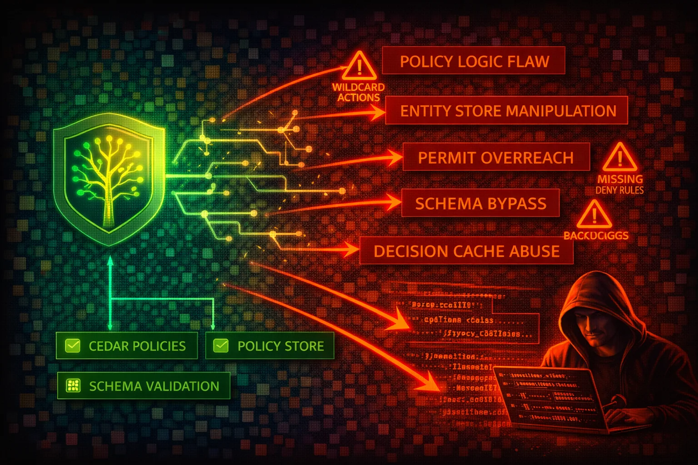

#  Amazon Verified Permissions Security



> **Category**: IDENTITY

Amazon Verified Permissions is a fully managed, fine-grained authorization service for custom applications. It uses the Cedar policy language to define permissions and make authorization decisions. Applications call the IsAuthorized or IsAuthorizedWithToken API to evaluate Cedar policies stored in a policy store and receive Allow or Deny decisions.


## Quick Stats

| Risk Level | Attack Vectors | Policy Language | Auth Model |
| --- | --- | --- | --- |
| **MEDIUM** | **10+** | **Cedar** | **RBAC + ABAC** |

## 📋 Service Overview

### Policy Stores

Central containers for Cedar policies, schemas, and identity sources. Each policy store holds static policies, template-linked policies, and policy templates. Policy stores support STRICT or OFF validation modes that determine whether policies are validated against the schema before being accepted.

> Key components: Static policies, policy templates, template-linked policies, schemas, identity sources, validation settings

### Cedar Policies and Authorization

Cedar is an open-source policy language with explicit `permit` and `forbid` effects. Authorization follows default-deny: if any `forbid` policy matches, the result is Deny; else if any `permit` policy matches, the result is Allow; otherwise the result is Deny. Policies define a principal, action, and resource scope with optional `when` and `unless` conditions.

> Key components: permit/forbid effects, principal/action/resource scope, when/unless conditions, entity hierarchy, schema validation

### Identity Sources (Cognito and OIDC Integration)

Identity sources connect external identity providers (Amazon Cognito user pools or custom OIDC providers) to a policy store. The IsAuthorizedWithToken API accepts ID or access tokens directly and maps token claims to Cedar entity attributes for policy evaluation.

> Key components: Cognito user pool integration, OIDC provider support, token-to-entity mapping, client/audience validation

## Security Risk Assessment

`██████░░░░` **6.0/10** (MEDIUM)

Verified Permissions is an application-layer authorization service. It does not directly control AWS resource access (that is IAM's role). However, misconfigurations in Cedar policies, schemas, or identity source mappings can lead to authorization bypass in the applications that rely on it. The primary risks are overly permissive Cedar policies, disabled schema validation, and flawed policy logic that grants unintended access.

## ⚔️ Attack Vectors

### Cedar Policy Logic Attacks

- Craft requests that exploit gaps between `permit` policies and missing `forbid` policies to gain access to unintended resources
- Abuse overly broad wildcard scopes in Cedar policies (e.g., `permit(principal, action, resource)` with no conditions) to access any resource
- Exploit principal identifier reuse when human-readable names are used instead of UUIDs, inheriting permissions of a former user
- Abuse template-linked policies with overly broad templates that grant excessive permissions when instantiated
- Exploit missing `unless` conditions on `permit` policies to bypass intended restrictions (e.g., time-based or IP-based limits)

### Infrastructure and Integration Attacks

- Enumerate policy stores, policies, and schemas via IAM permissions to map the entire authorization model before targeting specific gaps
- Tamper with identity source token claims if token validation is weak, causing Verified Permissions to evaluate policies against attacker-controlled attributes
- Exploit disabled schema validation (mode=OFF) to inject malformed policies that behave unexpectedly during authorization
- Abuse overly permissive IAM policies on `verifiedpermissions:CreatePolicy` to inject attacker-controlled Cedar policies into a policy store
- Target the application layer to bypass Verified Permissions entirely if the app fails to call IsAuthorized for every access decision

## ⚠️ Misconfigurations

### Cedar Policy Misconfigurations

- Schema validation set to OFF in production, allowing invalid or malformed policies to be stored without rejection
- Overly broad `permit` policies with no resource or principal constraints (e.g., `permit(principal, action, resource);`)
- Using human-readable identifiers (e.g., `User::"jane"`) instead of UUIDs, enabling identifier reuse attacks when users are offboarded
- Missing `forbid` policies for sensitive actions, relying solely on the absence of `permit` policies for denial
- Policy templates with unscoped placeholders that generate overly permissive template-linked policies when instantiated

### Infrastructure Misconfigurations

- IAM policies granting `verifiedpermissions:*` to application roles, allowing policy modification alongside authorization queries
- No separation between IAM permissions for read-only authorization (IsAuthorized) and write operations (CreatePolicy, UpdatePolicy, PutSchema)
- Identity source configured without client ID restrictions, accepting tokens from any app client in the Cognito user pool
- CloudTrail data events not enabled for IsAuthorized and IsAuthorizedWithToken, leaving authorization decisions unaudited
- No monitoring or alerting on policy store modifications (CreatePolicy, UpdatePolicy, DeletePolicy, PutSchema)

## 🔍 Enumeration

**List All Policy Stores**
```bash
aws verifiedpermissions list-policy-stores
```

**Get Policy Store Details**
```bash
aws verifiedpermissions get-policy-store \
  --policy-store-id PSEXAMPLEabcdefg111111
```

**List All Policies in a Policy Store**
```bash
aws verifiedpermissions list-policies \
  --policy-store-id PSEXAMPLEabcdefg111111
```

**Retrieve a Specific Policy**
```bash
aws verifiedpermissions get-policy \
  --policy-store-id PSEXAMPLEabcdefg111111 \
  --policy-id SPEXAMPLEabcdefg111111
```

**Get the Schema**
```bash
aws verifiedpermissions get-schema \
  --policy-store-id PSEXAMPLEabcdefg111111
```

**List Identity Sources**
```bash
aws verifiedpermissions list-identity-sources \
  --policy-store-id PSEXAMPLEabcdefg111111
```

**Get Identity Source Details**
```bash
aws verifiedpermissions get-identity-source \
  --policy-store-id PSEXAMPLEabcdefg111111 \
  --identity-source-id ISEXAMPLEabcdefg111111
```

**List Policy Templates**
```bash
aws verifiedpermissions list-policy-templates \
  --policy-store-id PSEXAMPLEabcdefg111111
```

**Test an Authorization Decision**
```bash
aws verifiedpermissions is-authorized \
  --policy-store-id PSEXAMPLEabcdefg111111 \
  --principal entityType=User,entityId=alice \
  --action actionType=Action,actionId=view \
  --resource entityType=Photo,entityId=VacationPhoto94.jpg
```

## 📈 Privilege Escalation

### Cedar Policy Injection

- If an attacker gains IAM permission to `verifiedpermissions:CreatePolicy`, they can inject a `permit(principal, action, resource);` policy granting themselves full access to every resource in the application
- If an attacker can `verifiedpermissions:UpdatePolicy`, they can modify existing policies to add their own principal or widen the resource scope
- If an attacker can `verifiedpermissions:PutSchema`, they can alter the schema to add new entity types or actions and then create policies that reference them

### Application-Level Escalation

- Exploit principal identifier reuse: if a user named "admin" is deleted and the attacker registers as "admin", they inherit all policies referencing `User::"admin"`
- Abuse group membership in Cognito tokens: if group claims are mapped to Cedar entities and group assignment is not tightly controlled, adding oneself to a privileged group grants corresponding Cedar permissions
- Exploit missing authorization checks in the application: if certain endpoints skip the IsAuthorized call, direct access bypasses the entire policy evaluation

> **Key Technique:** Enumerate the full policy set with `list-policies` and `get-policy`, then analyze Cedar policy logic offline to find gaps -- actions or resources with no corresponding `forbid` policy and overly broad `permit` policies.

## 🔗 Lateral Movement

### From Verified Permissions

- Map the full authorization model (policies, schema, identity sources) to understand which application resources are protected and which are not
- Use authorization decision testing (IsAuthorized) to probe which principal/action/resource combinations are allowed, identifying over-permissioned paths
- Identify identity sources to pivot to the connected Cognito user pool or OIDC provider for further attacks on the identity layer
- Analyze policy templates to understand reusable permission patterns and find broadly scoped templates

### Data Exfiltration

- Extract the complete schema to understand all entity types, actions, and relationships in the application
- Dump all policies to reverse-engineer the full authorization model and find authorization gaps
- Retrieve identity source configuration to discover connected Cognito user pool ARNs and OIDC provider URLs

## 🛡️ Detection

### CloudTrail Management Events (Logged by Default)

- `CreatePolicy` - new policy added to a policy store
- `DeletePolicy` - policy removed from a policy store
- `UpdatePolicy` - existing policy modified
- `PutSchema` - schema created or updated
- `CreatePolicyStore` - new policy store created
- `DeletePolicyStore` - policy store deleted
- `CreateIdentitySource` - identity source added
- `DeleteIdentitySource` - identity source removed
- `CreatePolicyTemplate` - policy template created

### CloudTrail Data Events (Must Be Explicitly Enabled)

- `IsAuthorized` - authorization decision requested
- `IsAuthorizedWithToken` - token-based authorization decision requested
- `BatchIsAuthorized` - batch authorization decisions requested

> **Important:** IsAuthorized and IsAuthorizedWithToken are data events and are NOT logged by default. You must explicitly enable data event logging for the `verifiedpermissions` resource type in your CloudTrail trail or event data store.

### Indicators of Compromise

- Unexpected CreatePolicy or UpdatePolicy events from unusual IAM principals
- PutSchema events that change the authorization model outside of normal deployment pipelines
- Spike in IsAuthorized calls returning DENY (possible authorization probing)
- DeletePolicy events removing forbid policies (weakening security controls)
- New identity sources added pointing to external OIDC providers

## 📜 Policy Examples

### Bad: Unrestricted Cedar Permit Policy

```
permit(principal, action, resource);
```

*This policy allows any principal to perform any action on any resource. It is the Cedar equivalent of `"Effect": "Allow", "Action": "*", "Resource": "*"` in IAM and should never be used.*

### Good: Scoped Cedar Permit Policy with Conditions

```
permit(
  principal in UserGroup::"viewers",
  action in Action::"readOnly",
  resource in Album::"publicPhotos"
)
when { context.mfaAuthenticated == true };
```

*This policy restricts access to the "viewers" group, read-only actions, a specific album, and requires MFA authentication in the request context.*

### Bad: IAM Policy Granting Full Verified Permissions Access

```json
{
  "Version": "2012-10-17",
  "Statement": [{
    "Effect": "Allow",
    "Action": "verifiedpermissions:*",
    "Resource": "*"
  }]
}
```

*Grants the ability to create, modify, and delete policies, schemas, and identity sources -- an attacker with this role can rewrite the entire authorization model.*

### Good: IAM Policy for Read-Only Authorization

```json
{
  "Version": "2012-10-17",
  "Statement": [{
    "Effect": "Allow",
    "Action": [
      "verifiedpermissions:IsAuthorized",
      "verifiedpermissions:IsAuthorizedWithToken",
      "verifiedpermissions:BatchIsAuthorized"
    ],
    "Resource": "arn:aws:verifiedpermissions::123456789012:policy-store/PSEXAMPLEabcdefg111111"
  }]
}
```

*Application role can only make authorization decisions against a specific policy store. Cannot modify policies, schemas, or identity sources.*

### Bad: Cedar Policy with Human-Readable Identifier

```
permit(
  principal == User::"jane",
  action,
  resource
);
```

*Uses a human-readable name. If "jane" leaves and a new person reuses the name, they inherit all permissions. Use UUIDs instead.*

### Good: Cedar Policy with UUID Identifier

```
permit(
  principal == User::"a1b2c3d4-e5f6-7890-abcd-ef1234567890",
  action in Action::"readOnly",
  resource in Album::"publicPhotos"
);
```

*Uses a UUID for the principal identifier, preventing identifier reuse attacks. Also scopes action and resource.*

## 🛡️ Defense Recommendations

### Enable STRICT Schema Validation

Always enable STRICT validation mode in production to ensure all policies are validated against the schema before being accepted.

```bash
aws verifiedpermissions update-policy-store \
  --policy-store-id PSEXAMPLEabcdefg111111 \
  --validation-settings "mode=STRICT"
```

### Separate IAM Permissions for Authorization vs. Administration

Grant application roles only IsAuthorized, IsAuthorizedWithToken, and BatchIsAuthorized. Reserve CreatePolicy, UpdatePolicy, DeletePolicy, PutSchema, and other write actions for deployment pipelines and administrators.

```json
{
  "Version": "2012-10-17",
  "Statement": [
    {
      "Sid": "AuthorizationOnly",
      "Effect": "Allow",
      "Action": [
        "verifiedpermissions:IsAuthorized",
        "verifiedpermissions:IsAuthorizedWithToken",
        "verifiedpermissions:BatchIsAuthorized"
      ],
      "Resource": "arn:aws:verifiedpermissions::*:policy-store/*"
    },
    {
      "Sid": "DenyPolicyModification",
      "Effect": "Deny",
      "Action": [
        "verifiedpermissions:CreatePolicy",
        "verifiedpermissions:UpdatePolicy",
        "verifiedpermissions:DeletePolicy",
        "verifiedpermissions:PutSchema",
        "verifiedpermissions:CreatePolicyTemplate",
        "verifiedpermissions:DeletePolicyTemplate"
      ],
      "Resource": "*"
    }
  ]
}
```

### Enable CloudTrail Data Events for Authorization Decisions

IsAuthorized and IsAuthorizedWithToken are classified as data events and are not logged by default. Enable data event logging to audit all authorization decisions.

### Use UUIDs for All Entity Identifiers

Use universally unique identifiers (UUIDs) for all principal and resource identifiers in Cedar policies. Never use human-readable names that can be reassigned.

### Restrict Identity Source Client IDs

When configuring a Cognito identity source, specify the exact app client IDs that are permitted. Do not leave client ID restrictions empty, as this accepts tokens from any client in the user pool.

### Implement Forbid Policies for Sensitive Actions

Do not rely solely on the absence of permit policies. Explicitly create `forbid` policies for sensitive actions to ensure they are denied even if a broad permit policy is accidentally introduced.

```
forbid(
  principal,
  action in Action::"deleteAccount",
  resource
)
unless { principal in UserGroup::"superAdmins" };
```

### Manage Policies as Code

Store Cedar policies in version control. Use CI/CD pipelines to deploy policy changes. Require code review for all policy modifications. This prevents ad-hoc policy changes that could introduce authorization gaps.

---

*Amazon Verified Permissions Security Card*

*Always obtain proper authorization before testing*
