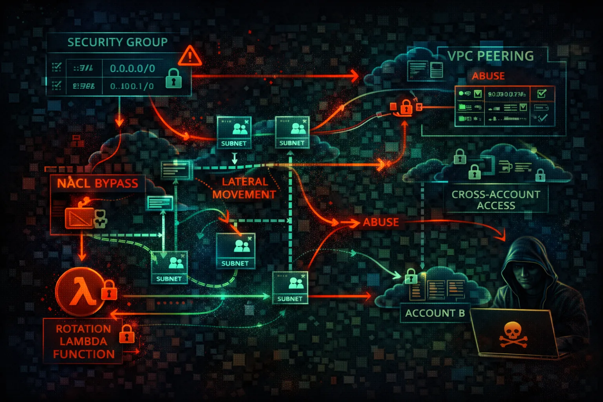

#  AWS VPC Security



> **Category**: NETWORKING

Virtual Private Cloud (VPC) provides network isolation with subnets, security groups, and NACLs. Network misconfigurations enable lateral movement and data exfiltration.

## Quick Stats

| Risk Level | Scope | + NACLs | + Transit GW |
| --- | --- | --- | --- |
| **HIGH** | **Regional** | **SGs** | **Peering** |

## Service Overview

### Network Controls

Security Groups are stateful firewalls at the instance level. Network ACLs are stateless firewalls at the subnet level. Route tables control traffic flow between subnets and to internet gateways.

> Attack note: Default VPC has public subnets with internet gateway - not designed for security

### Connectivity Options

VPC Peering, Transit Gateway, and VPN connections link VPCs together. PrivateLink and VPC Endpoints provide private access to AWS services without internet exposure.

> Attack note: VPC peering misconfigurations can allow cross-account lateral movement

## Security Risk Assessment

`███████░░░` **7.0/10** (HIGH)

VPC misconfigurations enable lateral movement between systems and data exfiltration. Open security groups, permissive peering, and missing VPC endpoints are common issues.

## ⚔️ Attack Vectors

### Network Access

- Open security groups (0.0.0.0/0)
- Default VPC with public subnets
- Missing egress filtering
- Direct internet access from instances
- NAT Gateway for exfiltration

### Lateral Movement

- Permissive VPC peering
- Transit Gateway routing
- Shared subnets in RAM
- Cross-account VPC access
- PrivateLink service abuse

## ⚠️ Misconfigurations

### Security Groups

- Ingress 0.0.0.0/0 on SSH/RDP
- All ports open
- No egress restrictions
- Referenced deleted groups
- Unused but attached groups

### Architecture

- Database in public subnet
- No private subnets
- Missing NAT Gateway
- VPC Flow Logs disabled
- Default NACL allows all

## 🔍 Enumeration

**List VPCs**
```bash
aws ec2 describe-vpcs
```

**List Subnets**
```bash
aws ec2 describe-subnets
```

**List Security Groups**
```bash
aws ec2 describe-security-groups
```

**List VPC Peering**
```bash
aws ec2 describe-vpc-peering-connections
```

**List VPC Endpoints**
```bash
aws ec2 describe-vpc-endpoints
```

## 📤 Data Exfiltration

### Outbound Routes

- NAT Gateway for large transfers
- Internet Gateway direct access
- VPC peering to external account
- VPN tunnel to attacker infra
- DNS tunneling via Route 53

### Service Routes

- S3 Gateway Endpoint
- EC2 Instance Connect Endpoint
- API Gateway public endpoint
- Lambda function URL
- CloudFront to attacker origin

> **Key insight:** Without egress filtering, any compromised instance can freely exfiltrate data.

## 🔗 Persistence

### Network-Based

- Create VPC peering to attacker
- Add route to malicious endpoint
- Create PrivateLink service
- Modify security group rules
- Add VPN connection

### Access-Based

- Create EC2 Instance Connect Endpoint
- Add NAT Instance as backdoor
- Client VPN endpoint
- Site-to-Site VPN
- Transit Gateway attachment

## 🛡️ Detection

### Monitoring

- VPC Flow Logs analysis
- CloudTrail network events
- GuardDuty network findings
- Traffic Mirroring
- Network Firewall logs

### Key Events

- CreateVpcPeeringConnection
- AuthorizeSecurityGroupIngress
- CreateRoute
- CreateVpcEndpoint
- AttachVpnGateway

## Exploitation Commands

**Open Security Group to Internet**
```bash
aws ec2 authorize-security-group-ingress \\
  --group-id sg-xxx \\
  --protocol tcp --port 22 --cidr 0.0.0.0/0
```

**Create VPC Peering**
```bash
aws ec2 create-vpc-peering-connection \\
  --vpc-id vpc-xxx \\
  --peer-vpc-id vpc-attacker \\
  --peer-owner-id ATTACKER_ACCOUNT
```

**Add Route to Peering**
```bash
aws ec2 create-route \\
  --route-table-id rtb-xxx \\
  --destination-cidr-block 10.0.0.0/8 \\
  --vpc-peering-connection-id pcx-xxx
```

**Create EC2 Instance Connect Endpoint**
```bash
aws ec2 create-instance-connect-endpoint \\
  --subnet-id subnet-xxx \\
  --security-group-ids sg-xxx
```

**Find Overly Permissive SGs**
```bash
aws ec2 describe-security-groups \\
  --query 'SecurityGroups[?IpPermissions[?IpRanges[?CidrIp==\`0.0.0.0/0\`]]]'
```

**Delete Security Group Rule**
```bash
aws ec2 revoke-security-group-ingress \\
  --group-id sg-xxx \\
  --protocol tcp --port 443 --cidr 10.0.0.0/8
```

## Policy Examples

### ❌ Dangerous - Public Database

```json
Subnet: public-subnet-1
Route Table:
  0.0.0.0/0 -> igw-xxx

Security Group:
  Inbound: 0.0.0.0/0 -> 3306
```

*Database directly accessible from internet*

### ✅ Secure - Private Subnet

```json
Subnet: private-subnet-1
Route Table:
  0.0.0.0/0 -> nat-xxx

Security Group:
  Inbound: sg-app-servers -> 3306
```

*Database only accessible from app layer*

### ❌ Dangerous - Open NACL

```json
Network ACL:
  Inbound:
    100: 0.0.0.0/0 -> All Traffic -> ALLOW
  Outbound:
    100: 0.0.0.0/0 -> All Traffic -> ALLOW
```

*No network-level traffic filtering*

### ✅ Secure - Restricted NACL

```json
Network ACL:
  Inbound:
    100: 10.0.0.0/16 -> TCP 443 -> ALLOW
    110: 10.0.0.0/16 -> TCP 1024-65535 -> ALLOW
    *: 0.0.0.0/0 -> All -> DENY
  Outbound: (similar restrictions)
```

*Only allow expected traffic patterns*

## Defense Recommendations

### 🔐 No 0.0.0.0/0 Ingress

Never allow all traffic from internet. Use specific CIDRs.

```bash
--cidr 10.0.0.0/8 (not 0.0.0.0/0)
```

### 🚫 Private Subnets by Default

Only use public subnets for load balancers and bastions.

```bash
aws ec2 modify-subnet-attribute --subnet-id SUBNET_ID --no-map-public-ip-on-launch
```

### 🔒 Enable VPC Flow Logs

Monitor all network traffic for analysis.

```bash
aws ec2 create-flow-logs \\
  --resource-type VPC --resource-ids vpc-xxx \\
  --traffic-type ALL
```

### 📝 Use VPC Endpoints

Access AWS services without internet gateway.

```bash
aws ec2 create-vpc-endpoint \\
  --vpc-id vpc-xxx --service-name com.amazonaws.REGION.s3
```

### 🌐 Network Firewall

Deep packet inspection and IDS/IPS capabilities.

```bash
aws network-firewall create-firewall ...
```

### 🔍 Security Group Rules Analysis

Use VPC Reachability Analyzer to find paths.

```bash
aws ec2 create-network-insights-path \\
  --source eni-xxx --destination eni-yyy
```

---

*AWS VPC Security Card*

*Always obtain proper authorization before testing*
