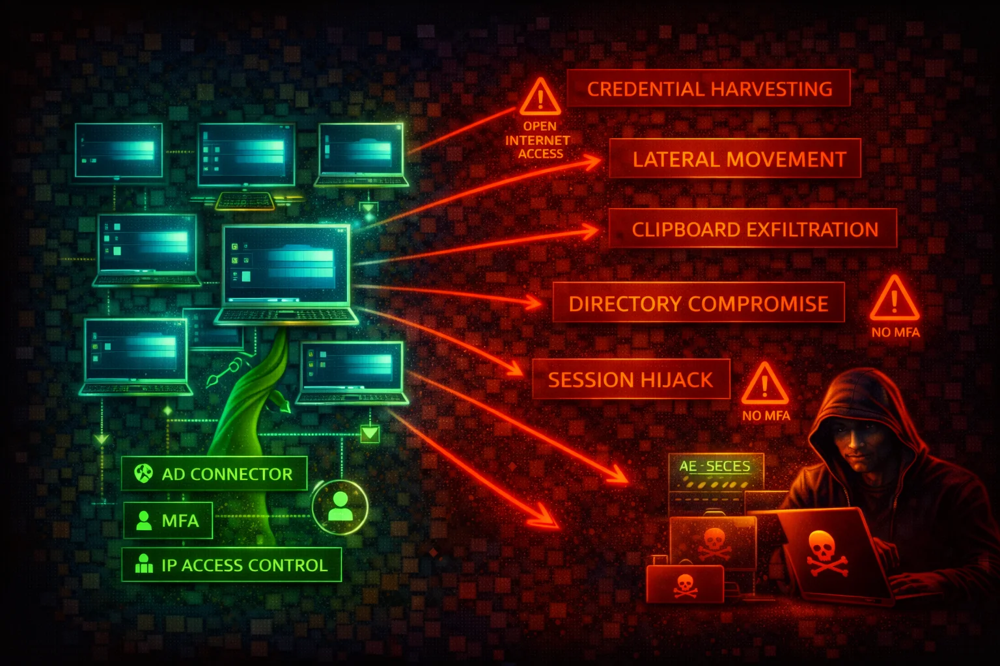

#  Amazon WorkSpaces Security



> **Category**: END-USER COMPUTING

## Quick Stats

| Attribute | Value |
|-----------|-------|
| **Risk Level** | HIGH |
| **Scope** | Per-Directory / Per-WorkSpace |
| **Key Components** | WorkSpaces Personal, WorkSpaces Pools, AD Connector, IP Access Control Groups, PCoIP/DCV Protocol |
| **Authentication** | Active Directory (AWS Managed Microsoft AD, AD Connector, Simple AD) |
| **MFA Support** | RADIUS-based MFA via AD Connector or AWS Managed Microsoft AD |
| **Streaming Protocols** | PCoIP, DCV (WSP) |

---

## 📋 Service Overview

Amazon WorkSpaces is a managed Desktop-as-a-Service (DaaS) that provisions cloud-based Windows or Linux virtual desktops. Each WorkSpace is associated with a directory (AWS Managed Microsoft AD, AD Connector, or Simple AD) and runs inside a customer VPC on dedicated compute.

WorkSpaces supports two streaming protocols: PCoIP and DCV (formerly WSP). Clients connect via native apps (Windows, macOS, Linux, iOS, Android) or a web browser. Features include clipboard redirection, drive redirection, USB redirection, and local printing.

**Attack note:** WorkSpaces are full virtual desktops with persistent storage. A compromised WorkSpace gives an attacker a foothold inside the customer VPC with AD-joined credentials, network access to internal resources, and potential clipboard/drive exfiltration paths. WorkSpaces are often overlooked in security monitoring because they sit outside traditional EC2-based detection.

**Attack note:** The directory backing WorkSpaces (AD Connector or AWS Managed Microsoft AD) is the single authentication plane. Compromising it grants access to all WorkSpaces in the directory, and potentially to on-premises AD via trust relationships.

---

## Security Risk Assessment

**Risk Score: 7.5 / 10 (HIGH)**

WorkSpaces provide full desktop environments inside the VPC with Active Directory credentials. Clipboard and drive redirection create data exfiltration channels. Without IP access control groups and MFA, WorkSpaces can be accessed from any IP with valid AD credentials. WorkSpaces run on AWS-managed compute that is not visible in the EC2 console, creating monitoring blind spots.

---

## ⚔️ Attack Vectors

### Initial Access & Credential Abuse

- **Credential stuffing against AD** -- WorkSpaces authenticate against Active Directory; compromised or sprayed AD credentials grant full desktop access
- **No MFA enforcement** -- Without RADIUS MFA configured, stolen AD credentials alone provide WorkSpace access from any location
- **No IP access control** -- Without IP access control groups, WorkSpaces accept connections from any public IP, expanding the attack surface
- **Phishing for WorkSpace registration codes** -- Registration codes (directory identifiers) combined with AD credentials enable unauthorized access
- **WorkSpaces Web (browser access) abuse** -- If Web Access is enabled, attackers can connect from unmanaged devices without client software

### Post-Compromise & Lateral Movement

- **VPC network pivoting** -- A compromised WorkSpace has a network interface in the customer VPC; attacker can scan and reach internal resources (databases, APIs, other WorkSpaces)
- **Clipboard exfiltration** -- Two-way clipboard redirection (enabled by default) allows copying sensitive data from the WorkSpace to a local machine
- **Drive redirection data theft** -- Local drive mapping allows transferring files between the WorkSpace and the attacker's local filesystem
- **AD credential harvesting** -- WorkSpaces are domain-joined; tools like Mimikatz on a compromised Windows WorkSpace can extract cached AD credentials, Kerberos tickets, or NTLM hashes
- **Persistence via WorkSpace rebuild resistance** -- Attackers can place payloads on the D: drive (user volume); during a WorkSpace rebuild, the user volume is recreated from the most recent automatic snapshot (taken every 12 hours), so payloads captured in a snapshot will persist through rebuilds

---

## ⚠️ Misconfigurations

### Access Control Gaps

- **No IP access control groups configured** -- WorkSpaces accept connections from any IP address by default; no IP-based restriction is applied unless you explicitly create and associate IP access control groups
- **MFA not enabled** -- RADIUS MFA is not configured by default; without it, only AD username/password is required
- **Web Access enabled without need** -- WorkSpaces Web Access allows browser-based connections, bypassing client-side controls; should be disabled if not required
- **Overly permissive security groups** -- The WorkSpaces security group allows outbound traffic to the internet, enabling command-and-control or data exfiltration
- **Unrestricted device types** -- By default, all client device types (Windows, macOS, iOS, Android, Linux, Web) are allowed; restricting to managed devices reduces risk

### Configuration & Data Protection Gaps

- **Clipboard redirection left enabled** -- Two-way clipboard redirection is on by default; this is a data exfiltration vector
- **Drive redirection not disabled** -- Local drive mapping is enabled by default, allowing file transfers between WorkSpace and local machine
- **Root volume not encrypted** -- WorkSpace volumes can be encrypted with AWS KMS, but encryption is not enabled by default
- **No user volume backup strategy** -- D: drive (user volume) data is not automatically backed up to S3; relying solely on WorkSpace snapshots
- **Running mode set to ALWAYS_ON without justification** -- Unnecessary ALWAYS_ON WorkSpaces increase cost and attack window; AUTO_STOP reduces exposure during idle periods

---

## 🔍 Enumeration

### List all WorkSpaces

```bash
aws workspaces describe-workspaces
```

### List registered directories

```bash
aws workspaces describe-workspace-directories
```

### Check WorkSpace connection status

```bash
aws workspaces describe-workspaces-connection-status
```

### List available bundles

```bash
aws workspaces describe-workspace-bundles --owner AMAZON
```

### List IP access control groups

```bash
aws workspaces describe-ip-groups
```

### Check workspace access properties (allowed device types)

```bash
aws workspaces describe-workspace-directories --query "Directories[*].{DirectoryId:DirectoryId,DeviceTypeWindows:WorkspaceAccessProperties.DeviceTypeWindows,DeviceTypeMacOs:WorkspaceAccessProperties.DeviceTypeMacOs,DeviceTypeWeb:WorkspaceAccessProperties.DeviceTypeWeb}"
```

### List WorkSpaces Pools

```bash
aws workspaces describe-workspaces-pools
```

### Describe connection aliases (custom access URLs)

```bash
aws workspaces describe-connection-aliases
```

---

## 📈 Privilege Escalation

- **workspaces:CreateWorkspaces with AD admin credentials** -- An attacker with this IAM permission can create new WorkSpaces joined to the directory, gaining a domain-joined desktop in the target VPC
- **workspaces:ModifyWorkspaceProperties** -- Change running mode, compute type, or protocol; can be used to upgrade a WorkSpace to a larger instance for resource-intensive attacks
- **workspaces:ModifyWorkspaceCreationProperties** -- Modify default internet access, custom security group, or default OU for new WorkSpaces; can weaken security posture for future WorkSpaces
- **workspaces:ModifyClientProperties** -- Re-enable reconnect capability, changing session behavior
- **workspaces:ModifyWorkspaceAccessProperties** -- Re-enable device types (e.g., enable Web Access) that were previously restricted
- **AD-level escalation from WorkSpace** -- A compromised Windows WorkSpace with local admin can run AD enumeration and attack tools (BloodHound, Rubeus, Mimikatz) against the domain, escalating from a single desktop to domain admin
- **workspaces:RebuildWorkspaces abuse** -- Rebuilding a WorkSpace resets the root volume but preserves user volume; if attacker placed persistence on user volume, the rebuild does not remove it

---

## 📜 Policy Examples

### BAD -- Overly permissive WorkSpaces admin

```json
{
  "Version": "2012-10-17",
  "Statement": [
    {
      "Effect": "Allow",
      "Action": "workspaces:*",
      "Resource": "*"
    }
  ]
}
```

**Why it is bad:** Grants full WorkSpaces control including creating, terminating, modifying, and rebuilding any WorkSpace. An attacker with these permissions can create rogue WorkSpaces, disable security controls, or terminate legitimate ones.

### GOOD -- Least-privilege read-only for monitoring

```json
{
  "Version": "2012-10-17",
  "Statement": [
    {
      "Effect": "Allow",
      "Action": [
        "workspaces:DescribeWorkspaces",
        "workspaces:DescribeWorkspaceDirectories",
        "workspaces:DescribeWorkspaceBundles",
        "workspaces:DescribeWorkspacesConnectionStatus",
        "workspaces:DescribeIpGroups",
        "workspaces:DescribeWorkspacesPoolSessions"
      ],
      "Resource": "*"
    }
  ]
}
```

**Why it is good:** Read-only access for monitoring and auditing. Cannot create, modify, or terminate WorkSpaces.

### GOOD -- Scoped WorkSpaces admin with directory restriction

```json
{
  "Version": "2012-10-17",
  "Statement": [
    {
      "Effect": "Allow",
      "Action": [
        "workspaces:CreateWorkspaces",
        "workspaces:TerminateWorkspaces",
        "workspaces:RebuildWorkspaces",
        "workspaces:StartWorkspaces",
        "workspaces:StopWorkspaces"
      ],
      "Resource": "*",
      "Condition": {
        "StringEquals": {
          "aws:ResourceTag/DirectoryId": "d-1234567890"
        }
      }
    }
  ]
}
```

**Why it is good:** Restricts WorkSpace lifecycle actions to resources tagged with a specific directory ID, preventing cross-directory abuse. Note: the only WorkSpaces-specific condition key is `workspaces:userId`; directory-level scoping requires tag-based conditions or resource ARN restrictions.

---

## 🛡️ Defense Recommendations

### 1. Enforce IP Access Control Groups

Create IP access control groups to restrict WorkSpace access to known corporate IP ranges or VPN egress IPs. Associate the group with each directory.

```bash
# Create an IP access control group
aws workspaces create-ip-group \
  --group-name "CorporateVPN" \
  --group-desc "Allow access from corporate VPN only" \
  --user-rules "ipRule=203.0.113.0/24,ruleDesc=Corporate VPN"

# Associate the group with a directory
aws workspaces associate-ip-groups \
  --directory-id d-1234567890 \
  --group-ids wsipg-abcdef123
```

### 2. Enable RADIUS MFA

Configure RADIUS-based multi-factor authentication on the directory. Use multiple RADIUS server IPs for redundancy.

### 3. Disable Clipboard and Drive Redirection

For Windows WorkSpaces, use Group Policy to disable or restrict clipboard redirection direction. For Linux WorkSpaces, modify the DCV configuration file. This closes a primary data exfiltration channel.

### 4. Restrict Device Types

Disable unnecessary device types (especially Web Access) via `modify-workspace-access-properties`:

```bash
aws workspaces modify-workspace-access-properties \
  --resource-id d-1234567890 \
  --workspace-access-properties \
    DeviceTypeWindows=ALLOW,DeviceTypeOsx=ALLOW,DeviceTypeWeb=DENY,DeviceTypeIos=DENY,DeviceTypeAndroid=DENY,DeviceTypeLinux=DENY
```

### 5. Enable Encryption at Rest

Encrypt both root and user volumes with AWS KMS when creating WorkSpaces. Encryption must be set at creation time and cannot be enabled later.

### 6. Use AUTO_STOP Running Mode

Set WorkSpaces to AUTO_STOP to reduce the attack window during idle periods and reduce cost:

```bash
aws workspaces modify-workspace-properties \
  --workspace-id ws-abc123def \
  --workspace-properties RunningMode=AUTO_STOP,RunningModeAutoStopTimeoutInMinutes=60
```

### 7. Monitor with CloudTrail and VPC Flow Logs

- Enable CloudTrail logging for all `workspaces:*` API calls
- Enable VPC Flow Logs on the WorkSpaces subnets to detect lateral movement
- Monitor `WorkSpaces` CloudWatch metrics for unusual connection patterns (e.g., connections from unexpected regions)

### 8. Restrict Outbound Network Access

Apply restrictive security groups and NACLs to WorkSpaces subnets. Block direct internet access; route traffic through a proxy or NAT Gateway with URL filtering.

---

## Sources

| Claim | Source URL | Verified |
|-------|-----------|----------|
| WorkSpaces CLI commands (describe-workspaces, describe-workspace-directories, etc.) | https://docs.aws.amazon.com/cli/latest/reference/workspaces/index.html | 2026-03-30 |
| IP access control groups filter by source CIDR | https://docs.aws.amazon.com/workspaces/latest/adminguide/amazon-workspaces-ip-access-control-groups.html | 2026-03-30 |
| MFA requires RADIUS via AD Connector or AWS Managed Microsoft AD | https://docs.aws.amazon.com/whitepapers/latest/best-practices-deploying-amazon-workspaces/security.html | 2026-03-30 |
| Clipboard redirection enabled by default, max 20 MB uncompressed | https://docs.aws.amazon.com/workspaces/latest/adminguide/group_policy.html | 2026-03-30 |
| Group Policy controls clipboard and drive redirection for Windows WorkSpaces | https://docs.aws.amazon.com/workspaces/latest/adminguide/group_policy.html | 2026-03-30 |
| DCV configuration for Linux clipboard settings | https://docs.aws.amazon.com/workspaces/latest/adminguide/manage_linux_workspace.html | 2026-03-30 |
| WorkSpaces Web Access limitations | https://docs.aws.amazon.com/workspaces/latest/adminguide/web-access.html | 2026-03-30 |
| IAM actions for WorkSpaces (CreateWorkspaces, DescribeWorkspaces, etc.) | https://docs.aws.amazon.com/service-authorization/latest/reference/list_amazonworkspaces.html | 2026-03-30 |
| WorkSpaces security overview | https://docs.aws.amazon.com/workspaces/latest/adminguide/security.html | 2026-03-30 |
| WorkSpaces best practices for security | https://docs.aws.amazon.com/whitepapers/latest/best-practices-deploying-amazon-workspaces/security.html | 2026-03-30 |
| AD Connector role with WorkSpaces, RADIUS MFA multi-server | https://docs.aws.amazon.com/whitepapers/latest/best-practices-deploying-amazon-workspaces/ad-connector-role-with-workspaces.html | 2026-03-30 |
| modify-workspace-access-properties CLI | https://docs.aws.amazon.com/cli/latest/reference/workspaces/modify-workspace-access-properties.html | 2026-03-30 |
| modify-workspace-properties CLI | https://docs.aws.amazon.com/cli/latest/reference/workspaces/modify-workspace-properties.html | 2026-03-30 |
| create-ip-group CLI | https://docs.aws.amazon.com/cli/latest/reference/workspaces/create-ip-group.html | 2026-03-30 |
| associate-ip-groups CLI | https://docs.aws.amazon.com/cli/latest/reference/workspaces/associate-ip-groups.html | 2026-03-30 |
| describe-ip-groups CLI | https://docs.aws.amazon.com/cli/latest/reference/workspaces/describe-ip-groups.html | 2026-03-30 |
| describe-workspaces-connection-status CLI | https://docs.aws.amazon.com/cli/latest/reference/workspaces/describe-workspaces-connection-status.html | 2026-03-30 |
| describe-workspace-bundles CLI | https://docs.aws.amazon.com/cli/latest/reference/workspaces/describe-workspace-bundles.html | 2026-03-30 |
| USB redirection support on PCoIP and DCV | https://docs.aws.amazon.com/workspaces/latest/userguide/usb-redirection.html | 2026-03-30 |
| Rebuild resets root volume (C:) but preserves user volume (D:) | https://docs.aws.amazon.com/cli/latest/reference/workspaces/rebuild-workspaces.html | 2026-03-30 |
| CVE-2021-38112: WorkSpaces client RCE | https://rhinosecuritylabs.com/aws/cve-2021-38112-aws-workspaces-rce/ | NEEDS VERIFICATION |
| WorkSpaces Linux token extraction vulnerability | https://cybersecuritynews.com/amazon-workspaces-linux-vulnerability/ | NEEDS VERIFICATION |
